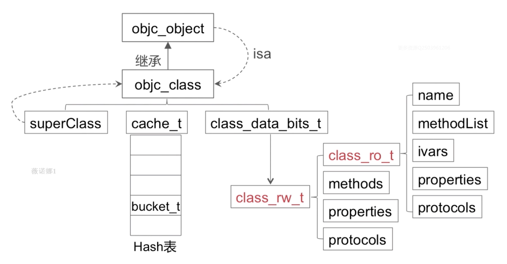
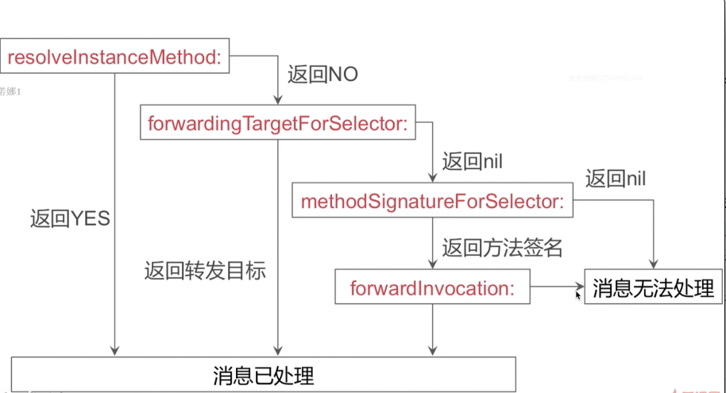
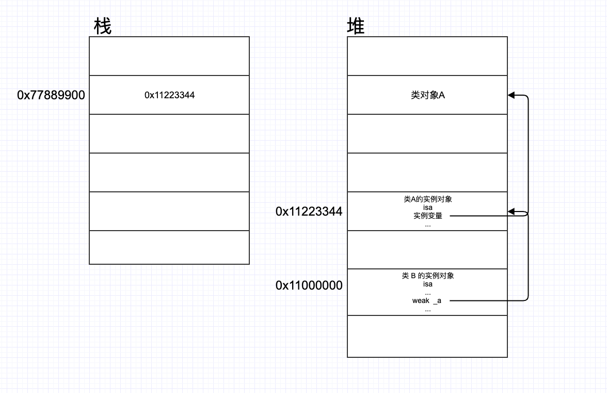
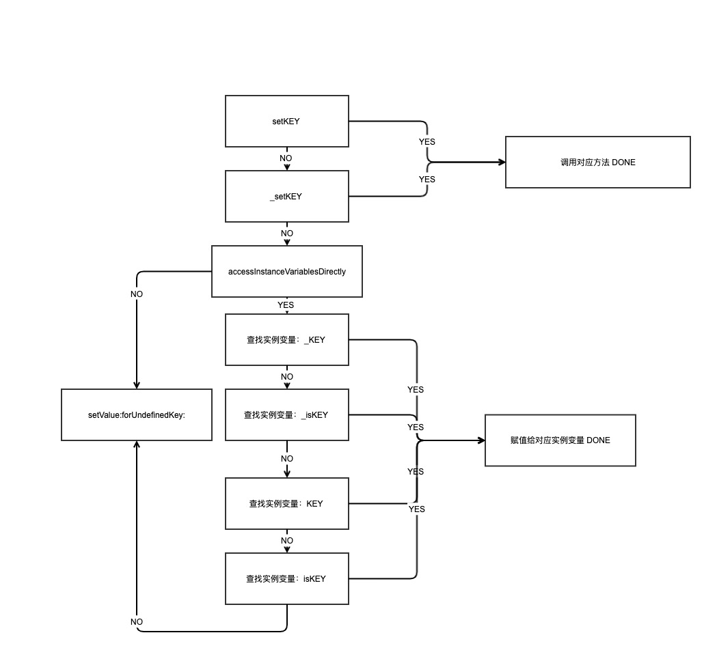
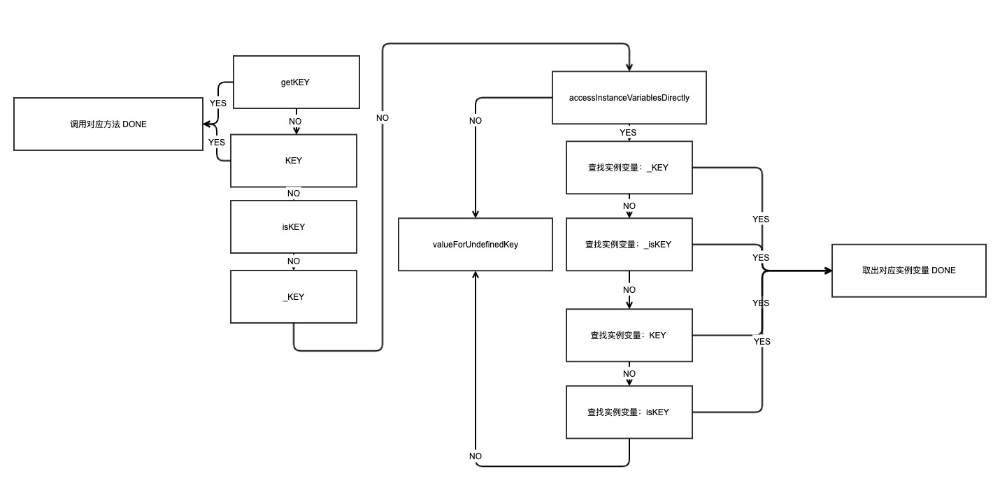

# 阿里、字节 一套高效的iOS面试题解答
> - 面试题出自掘金的一篇文章[《阿里、字节：一套高效的iOS面试题》](https://links.jianshu.com/go?to=https%3A%2F%2Fjuejin.im%2Fpost%2F5e397ccaf265da570b3f1b02)
> - 欢迎转载，转载请注明出处：[pmst-swiftgg](https://links.jianshu.com/go?to=%5Bhttps%3A%2F%2Fwww.jianshu.com%2Fp%2Fc1765a6305ab%5D(https%3A%2F%2Fwww.jianshu.com%2Fp%2Fc1765a6305ab))
> - 调试好可运行的源码 [objc-runtime](https://links.jianshu.com/go?to=https%3A%2F%2Fgithub.com%2Fcolourful987%2F2020-Read-Record%2Ftree%2Fmaster%2FAnnotated%20source%20code%2Fobjc4-750)，官网找 [objc4](https://links.jianshu.com/go?to=https%3A%2F%2Fopensource.apple.com%2Ftarballs%2Fobjc4%2F)
> - 最后修订：2020/05/11

[TOC]

# 一、runtime相关问题

> * 调试好可运行的源码 [objc-runtime](https://github.com/colourful987/2020-Read-Record/tree/master/Annotated%20source%20code/objc4-750)，官网找 [objc4](https://opensource.apple.com/tarballs/objc4/)；
>

## 结构模型

### 1. 介绍下runtime的内存模型（isa、对象、类、metaclass、结构体的存储信息等）


### 2. 为什么要设计metaclass

* 类对象、元类对象能够复用消息发送流程机制；
* 单一职责原则

### 3. `class_copyIvarList` & `class_copyPropertyList`区别

`property` 正常使用会生成对应的实例变量，所以 `Ivar` 可以查到。

`class_copyIvarList` 获取类对象中的所有实例变量信息，从 `class_ro_t` 中获取：

```objective-c
Ivar *
class_copyIvarList(Class cls, unsigned int *outCount)
{
    const ivar_list_t *ivars;
    Ivar *result = nil;
    unsigned int count = 0;

    if (!cls) {
        if (outCount) *outCount = 0;
        return nil;
    }

    mutex_locker_t lock(runtimeLock);

    assert(cls->isRealized());
    
    if ((ivars = cls->data()->ro->ivars)  &&  ivars->count) {
        result = (Ivar *)malloc((ivars->count+1) * sizeof(Ivar));
        
        for (auto& ivar : *ivars) {
            if (!ivar.offset) continue;  // anonymous bitfield
            result[count++] = &ivar;
        }
        result[count] = nil;
    }
    
    if (outCount) *outCount = count;
    return result;
}
```

`class_copyPropertyList` 获取类对象中的属性信息， `class_rw_t` 的 `properties`，先后输出了 category / extension/ baseClass 的属性，而且仅输出当前的类的属性信息，而不会向上去找 superClass 中定义的属性。

```objective-c
objc_property_t *
class_copyPropertyList(Class cls, unsigned int *outCount)
{
    if (!cls) {
        if (outCount) *outCount = 0;
        return nil;
    }

    mutex_locker_t lock(runtimeLock);

    checkIsKnownClass(cls);
    assert(cls->isRealized());
    
    auto rw = cls->data();

    property_t **result = nil;
    unsigned int count = rw->properties.count();
    if (count > 0) {
        result = (property_t **)malloc((count + 1) * sizeof(property_t *));

        count = 0;
        for (auto& prop : rw->properties) {
            result[count++] = &prop;
        }
        result[count] = nil;
    }

    if (outCount) *outCount = count;
    return (objc_property_t *)result;
}
```

> Q1: `class_ro_t` 中的 `baseProperties` 呢？
>
> Q2: `class_rw_t` 中的 `properties` 包含了所有属性，那何时注入进去的呢？ 答案见 5.

### 4. `class_rw_t` 和 `class_ro_t` 的区别



测试发现，`class_rw_t` 中的 `properties` 属性按顺序包含分类/扩展/基类中的属性。

```objective-c
struct class_ro_t {
    uint32_t flags;
    uint32_t instanceStart;
    uint32_t instanceSize;
#ifdef __LP64__
    uint32_t reserved;
#endif

    const uint8_t * ivarLayout;
    
    const char * name;
    method_list_t * baseMethodList;
    protocol_list_t * baseProtocols;
    const ivar_list_t * ivars;

    const uint8_t * weakIvarLayout;
    property_list_t *baseProperties;

    method_list_t *baseMethods() const {
        return baseMethodList;
    }
};

struct class_rw_t {
    // Be warned that Symbolication knows the layout of this structure.
    uint32_t flags;
    uint32_t version;

    const class_ro_t *ro;

    method_array_t methods;
    property_array_t properties;
    protocol_array_t protocols;

    Class firstSubclass;
    Class nextSiblingClass;

    char *demangledName;

#if SUPPORT_INDEXED_ISA
    uint32_t index;
#endif
}
```


### 5. `category`如何被加载的,两个category的`load`方法的加载顺序，两个category的同名方法的加载顺序

> `+load` 方法是 images 加载的时候调用，假设有一个 Person 类，其主类和所有分类的 `+load` 都会被调用，优先级是先调用主类，且如果主类有继承链，那么加载顺序还必须是基类的 `+load` ，接着是父类，最后是子类；category 的 `+load` 则是按照编译顺序来的，后编译的先调用；
>
> 另外一个问题是 `initialize` 的加载顺序，其实是类第一次被使用到的时候会被调用，底层实现有个逻辑先判断父类是否被初始化过，没有则先调用父类，然后在调用当前类的 `initialize` 方法；如果`+load` 方法中调用了其他类：比如 B 的某个方法，其实说白了就是走消息发送流程，由于 B 没有初始化过，则会调用其 initialize 方法，但此刻 B 的 +load 方法可能还没有被系统调用过。

`... -> realizeClass -> methodizeClass(用于Attach categories)-> attachCategories` 关键就是在 methodizeClass 方法实现中

```objective-c
static void methodizeClass(Class cls)
{
    runtimeLock.assertLocked();

    bool isMeta = cls->isMetaClass();
    auto rw = cls->data();
    auto ro = rw->ro;
  	
  	// =======================================
		// 省略.....
  	// =======================================
  
    property_list_t *proplist = ro->baseProperties;
    if (proplist) {
        rw->properties.attachLists(&proplist, 1);
    }

  	// =======================================
		// 省略.....
  	// =======================================

    // Attach categories.
    category_list *cats = unattachedCategoriesForClass(cls, true /*realizing*/);
    attachCategories(cls, cats, false /*don't flush caches*/);

  	// =======================================
		// 省略.....
  	// =======================================
    
    if (cats) free(cats);

}
```

上面代码能确定 baseProperties 在前，category 在后，但决定顺序的是 `rw->properties.attachLists` 这个方法：

```objective-c
property_list_t *proplist = ro->baseProperties;
if (proplist) {
  rw->properties.attachLists(&proplist, 1);
}

/// category 被附加进去
void attachLists(List* const * addedLists, uint32_t addedCount) {
        if (addedCount == 0) return;

        if (hasArray()) {
            // many lists -> many lists
            uint32_t oldCount = array()->count;
            uint32_t newCount = oldCount + addedCount;
            setArray((array_t *)realloc(array(), array_t::byteSize(newCount)));
            array()->count = newCount;
            
            // 将旧内容移动偏移量 addedCount 然后将 addedLists copy 到起始位置
          	/*
          		struct array_t {
        				uint32_t count;
        				List* lists[0];
    					};
          	*/
            memmove(array()->lists + addedCount, array()->lists, 
                    oldCount * sizeof(array()->lists[0]));
            memcpy(array()->lists, addedLists, 
                   addedCount * sizeof(array()->lists[0]));
        }
        else if (!list  &&  addedCount == 1) {
            // 0 lists -> 1 list
            list = addedLists[0];
        } 
        else {
            // 1 list -> many lists
            List* oldList = list;
            uint32_t oldCount = oldList ? 1 : 0;
            uint32_t newCount = oldCount + addedCount;
            setArray((array_t *)malloc(array_t::byteSize(newCount)));
            array()->count = newCount;
            if (oldList) array()->lists[addedCount] = oldList;
            memcpy(array()->lists, addedLists, 
                   addedCount * sizeof(array()->lists[0]));
        }
    }
```

所以 category 的属性总是在前面的，baseClass的属性被往后偏移了。

>  Q1：那么多个 category 的顺序呢？答案见6

2020/03/18 补充下应用程序 image 镜像加载到内存中时， Category 解析的过程，注意下面的 `while(i--)` 这里倒叙将 category 中的协议 方法 属性添加到了 `rw = cls->data()` 中的 `methods/properties/protocols` 中。

```objective-c
static void 
attachCategories(Class cls, category_list *cats, bool flush_caches)
{
    if (!cats) return;
    if (PrintReplacedMethods) printReplacements(cls, cats);

    bool isMeta = cls->isMetaClass();

    // fixme rearrange to remove these intermediate allocations
    method_list_t **mlists = (method_list_t **)
        malloc(cats->count * sizeof(*mlists));
    property_list_t **proplists = (property_list_t **)
        malloc(cats->count * sizeof(*proplists));
    protocol_list_t **protolists = (protocol_list_t **)
        malloc(cats->count * sizeof(*protolists));

    // Count backwards through cats to get newest categories first
    int mcount = 0;
    int propcount = 0;
    int protocount = 0;
    int i = cats->count;
    bool fromBundle = NO;
    while (i--) {
        auto& entry = cats->list[i];

        method_list_t *mlist = entry.cat->methodsForMeta(isMeta);
        if (mlist) {
            mlists[mcount++] = mlist;
            fromBundle |= entry.hi->isBundle();
        }

        property_list_t *proplist = 
            entry.cat->propertiesForMeta(isMeta, entry.hi);
        if (proplist) {
            proplists[propcount++] = proplist;
        }

        protocol_list_t *protolist = entry.cat->protocols;
        if (protolist) {
            protolists[protocount++] = protolist;
        }
    }
    auto rw = cls->data();
		
  	// 注意下面的代码，上面采用倒叙遍历方式，所以后编译的 category 会先add到数组的前部
    prepareMethodLists(cls, mlists, mcount, NO, fromBundle);
    rw->methods.attachLists(mlists, mcount);
    free(mlists);
    if (flush_caches  &&  mcount > 0) flushCaches(cls);

    rw->properties.attachLists(proplists, propcount);
    free(proplists);

    rw->protocols.attachLists(protolists, protocount);
    free(protolists);
}
```


### 6. `category` & `extension`区别，能给NSObject添加Extension吗，结果如何

category:

* 运行时添加分类属性/协议/方法
* 分类添加的方法会“覆盖”原类方法，因为方法查找的话是从头至尾，一旦查找到了就停止了
* 同名分类方法谁生效取决于编译顺序，image 读取的信息是倒叙的，所以编译越靠后的越先读入
* 名字相同的分类会引起编译报错；

extension:

* 编译时决议
* 只以声明的形式存在，多数情况下就存在于 .m 文件中；
* 不能为系统类添加扩展

### 7. 消息转发机制，消息转发机制和其他语言的消息机制优劣对比



### 8. 在方法调用的时候，`方法查询-> 动态解析-> 消息转发` 之前做了什么

OC中的方法调用，编译后的代码最终都会转成 `objc_msgSend(id , SEL, ...)` 方法进行调用，这个方法第一个参数是一个消息接收者对象，runtime通过这个对象的isa指针找到这个对象的类对象，从类对象中的cache中查找(**哈希查找，bucket 桶实现**)是否存在SEL对应的IMP，若不存在，则会在 method_list中查找（二分查找或者顺序查找），如果还是没找到，则会到supper_class中查找，仍然没找到的话，就会调用_objc_msgForward(id, SEL, ...)进行消息转发。

### 9. `IMP`、`SEL`、`Method`的区别和使用场景

三者的定义：

```objective-c
typedef struct method_t *Method;

using MethodListIMP = IMP;

struct method_t {
    SEL name;
    const char *types;
    MethodListIMP imp;
};
```

Method 同样是个对象，封装了方法名和实现，关于 [Type Encodings](https://developer.apple.com/library/archive/documentation/Cocoa/Conceptual/ObjCRuntimeGuide/Articles/ocrtTypeEncodings.html#//apple_ref/doc/uid/TP40008048-CH100-SW1)。

| Code               | Meaning                                                      |
| :----------------- | :----------------------------------------------------------- |
| `c`                | A `char`                                                     |
| `i`                | An `int`                                                     |
| `s`                | A `short`                                                    |
| `l`                | A `long l` is treated as a 32-bit quantity on 64-bit programs. |
| `q`                | A `long long`                                                |
| `C`                | An `unsigned char`                                           |
| `I`                | An `unsigned int`                                            |
| `S`                | An `unsigned short`                                          |
| `L`                | An `unsigned long`                                           |
| `Q`                | An `unsigned long long`                                      |
| `f`                | A `float`                                                    |
| `d`                | A `double`                                                   |
| `B`                | A C++ `bool` or a C99 `_Bool`                                |
| `v`                | A `void`                                                     |
| `*`                | A character string (`char *`)                                |
| `@`                | An object (whether statically typed or typed `id`)           |
| `#`                | A class object (`Class`)                                     |
| `:`                | A method selector (`SEL`)                                    |
| [*array type*]     | An array                                                     |
| {*name=type...*}   | A structure                                                  |
| (*name*=*type...*) | A union                                                      |
| `b`num             | A bit field of *num* bits                                    |
| `^`type            | A pointer to *type*                                          |
| `?`                | An unknown type (among other things, this code is used for function pointers) |

 `-(void)hello:(NSString *)name` encode 下就是 `v@:@`。

### 10. `load`、`initialize`方法的区别什么？在继承关系中他们有什么区别

load 方法调用时机，而且只调用当前类本身，不会调用superClass 的 `+load` 方法：

```objective-c
void
load_images(const char *path __unused, const struct mach_header *mh)
{
    // Return without taking locks if there are no +load methods here.
    if (!hasLoadMethods((const headerType *)mh)) return;

    recursive_mutex_locker_t lock(loadMethodLock);

    // Discover load methods
    {
        mutex_locker_t lock2(runtimeLock);
        prepare_load_methods((const headerType *)mh);
    }

    // Call +load methods (without runtimeLock - re-entrant)
    call_load_methods();
}

void call_load_methods(void)
{
    static bool loading = NO;
    bool more_categories;

    loadMethodLock.assertLocked();

    // Re-entrant calls do nothing; the outermost call will finish the job.
    if (loading) return;
    loading = YES;

    void *pool = objc_autoreleasePoolPush();

    do {
        // 1. Repeatedly call class +loads until there aren't any more
        while (loadable_classes_used > 0) {
            call_class_loads();
        }

        // 2. Call category +loads ONCE
        more_categories = call_category_loads();

        // 3. Run more +loads if there are classes OR more untried categories
    } while (loadable_classes_used > 0  ||  more_categories);

    objc_autoreleasePoolPop(pool);

    loading = NO;
}
```

`+initialize` 实现

```objective-c
void _class_initialize(Class cls)
{
    assert(!cls->isMetaClass());

    Class supercls;
    bool reallyInitialize = NO;

    // Make sure super is done initializing BEFORE beginning to initialize cls.
    // See note about deadlock above.
    supercls = cls->superclass;
    if (supercls  &&  !supercls->isInitialized()) {
        _class_initialize(supercls);
    }
    
    // Try to atomically set CLS_INITIALIZING.
    {
        monitor_locker_t lock(classInitLock);
        if (!cls->isInitialized() && !cls->isInitializing()) {
            cls->setInitializing();
            reallyInitialize = YES;
        }
    }
    
    if (reallyInitialize) {
        // We successfully set the CLS_INITIALIZING bit. Initialize the class.
        
        // Record that we're initializing this class so we can message it.
        _setThisThreadIsInitializingClass(cls);

        if (MultithreadedForkChild) {
            // LOL JK we don't really call +initialize methods after fork().
            performForkChildInitialize(cls, supercls);
            return;
        }
        
        // Send the +initialize message.
        // Note that +initialize is sent to the superclass (again) if 
        // this class doesn't implement +initialize. 2157218
        if (PrintInitializing) {
            _objc_inform("INITIALIZE: thread %p: calling +[%s initialize]",
                         pthread_self(), cls->nameForLogging());
        }

        // Exceptions: A +initialize call that throws an exception 
        // is deemed to be a complete and successful +initialize.
        //
        // Only __OBJC2__ adds these handlers. !__OBJC2__ has a
        // bootstrapping problem of this versus CF's call to
        // objc_exception_set_functions().
#if __OBJC2__
        @try
#endif
        {
            callInitialize(cls);

            if (PrintInitializing) {
                _objc_inform("INITIALIZE: thread %p: finished +[%s initialize]",
                             pthread_self(), cls->nameForLogging());
            }
        }
#if __OBJC2__
        @catch (...) {
            if (PrintInitializing) {
                _objc_inform("INITIALIZE: thread %p: +[%s initialize] "
                             "threw an exception",
                             pthread_self(), cls->nameForLogging());
            }
            @throw;
        }
        @finally
#endif
        {
            // Done initializing.
            lockAndFinishInitializing(cls, supercls);
        }
        return;
    }
    
    else if (cls->isInitializing()) {
        // We couldn't set INITIALIZING because INITIALIZING was already set.
        // If this thread set it earlier, continue normally.
        // If some other thread set it, block until initialize is done.
        // It's ok if INITIALIZING changes to INITIALIZED while we're here, 
        //   because we safely check for INITIALIZED inside the lock 
        //   before blocking.
        if (_thisThreadIsInitializingClass(cls)) {
            return;
        } else if (!MultithreadedForkChild) {
            waitForInitializeToComplete(cls);
            return;
        } else {
            // We're on the child side of fork(), facing a class that
            // was initializing by some other thread when fork() was called.
            _setThisThreadIsInitializingClass(cls);
            performForkChildInitialize(cls, supercls);
        }
    }
    
    else if (cls->isInitialized()) {
        // Set CLS_INITIALIZING failed because someone else already 
        //   initialized the class. Continue normally.
        // NOTE this check must come AFTER the ISINITIALIZING case.
        // Otherwise: Another thread is initializing this class. ISINITIALIZED 
        //   is false. Skip this clause. Then the other thread finishes 
        //   initialization and sets INITIALIZING=no and INITIALIZED=yes. 
        //   Skip the ISINITIALIZING clause. Die horribly.
        return;
    }
    
    else {
        // We shouldn't be here. 
        _objc_fatal("thread-safe class init in objc runtime is buggy!");
    }
}

void callInitialize(Class cls)
{
    ((void(*)(Class, SEL))objc_msgSend)(cls, SEL_initialize);
    asm("");
}
```

注意看上面的调用了 ` callInitialize(cls)` 然后又调用了 `lockAndFinishInitializing(cls, supercls)`。 

> 摘自[iOS App冷启动治理](https://juejin.im/post/5c0a17d6e51d4570cf60d102?utm_source=gold_browser_extension) 一文中对 Dyld 在各阶段所做的事情：

| 阶段         | 工作                                                         |
| ------------ | ------------------------------------------------------------ |
| 加载动态库   | Dyld从主执行文件的header获取到需要加载的所依赖动态库列表，然后它需要找到每个 dylib，而应用所依赖的 dylib 文件可能会再依赖其他 dylib，所以所需要加载的是动态库列表一个递归依赖的集合 |
| Rebase和Bind | - Rebase在Image内部调整指针的指向。在过去，会把动态库加载到指定地址，所有指针和数据对于代码都是对的，而现在地址空间布局是随机化，所以需要在原来的地址根据随机的偏移量做一下修正 - Bind是把指针正确地指向Image外部的内容。这些指向外部的指针被符号(symbol)名称绑定，dyld需要去符号表里查找，找到symbol对应的实现 |
| Objc setup   | - 注册Objc类 (class registration) - 把category的定义插入方法列表 (category registration) - 保证每一个selector唯一 (selector uniqing) |
| Initializers | - Objc的+load()函数 - C++的构造函数属性函数 - 非基本类型的C++静态全局变量的创建(通常是类或结构体) |

最后 dyld 会调用 main() 函数，main() 会调用 UIApplicationMain()，before main()的过程也就此完成。

### 11. 说说消息转发机制的优劣

## 内存管理

### 1.`weak`的实现原理？`SideTable`的结构是什么样的

> 解答参考自瓜神的[ weak 弱引用的实现方式](https://www.desgard.com/iOS-Source-Probe/Objective-C/Runtime/weak%20弱引用的实现方式.html) 。

```objective-c
NSObject *p = [[NSObject alloc] init];
__weak NSObject *p1 = p;
// ====> 底层是runtime的 objc_initWeak
// xcrun -sdk iphoneos clang -arch arm64 -rewrite-objc -fobjc-arc -fobjc-runtime=ios-13.2 main.m 得不到下面的代码，还是说命令参数不对。
NSObject objc_initWeak(&p, 对象指针);
```

通过 runtime 源码可以看到 `objc_initWeak` 实现：

```objective-c
id
objc_initWeakOrNil(id *location, id newObj)
{
    if (!newObj) {
        *location = nil;
        return nil;
    }

    return storeWeak<DontHaveOld, DoHaveNew, DontCrashIfDeallocating>
        (location, (objc_object*)newObj);
}
```
SideTable 结构体在 runtime 底层用于引用计数和弱引用关联表，其数据结构是这样：

```c++
struct SideTable {
    // 自旋锁
    spinlock_t slock;
    // 引用计数
    RefcountMap refcnts;
    // weak 引用
    weak_table_t weak_table;
}

struct weak_table_t {
    // 保存了所有指向指定对象的 weak 指针
    weak_entry_t *weak_entries;
    // 存储空间
    size_t    num_entries;
    // 参与判断引用计数辅助量
    uintptr_t mask;
    // hash key 最大偏移值
    uintptr_t max_hash_displacement;
};
```

根据对象的地址在缓存中取出对应的 `SideTable` 实例：

```c++
static SideTable *tableForPointer(const void *p)
```

或者如上面源码中 ` &SideTables()[newObj]` 方式取表，**这里的 newObj 是实例对象用其指针作为 key 拿到 从全局的 SideTables 中拿到实例自身对应的那张 SideTable**。

```
static StripedMap<SideTable>& SideTables() {
    return *reinterpret_cast<StripedMap<SideTable>*>(SideTableBuf);
}
```

取出实例方法的实现中，使用了 C++ 标准转换运算符 **reinterpret_cast** ，其表达方式为：

```c++
reinterpret_cast <new_type> (expression)
```

每一个  weak 关键字修饰的对象都是用 `weak_entry_t` 结构体来表示，所以在实例中声明定义的 weak 对象都会被封装成 `weak_entry_t` 加入到该 SideTable 中 `weak_table` 中

```c++
typedef objc_object ** weak_referrer_t;

struct weak_entry_t {
    DisguisedPtr<objc_object> referent;
    union {
        struct {
            weak_referrer_t *referrers;
            uintptr_t        out_of_line : 1;
            uintptr_t        num_refs : PTR_MINUS_1;
            uintptr_t        mask;
            uintptr_t        max_hash_displacement;
        };
        struct {
            // out_of_line=0 is LSB of one of these (don't care which)
            weak_referrer_t  inline_referrers[WEAK_INLINE_COUNT];
        };
 }
```

旧对象解除注册操作 `weak_unregister_no_lock` 和 新对象添加注册操作 `weak_register_no_lock` ，具体实现可前往 runtime 源码中查看或查看瓜的博文。



`weak` 关键字修饰的对象有两种情况：栈上和堆上。上图主要解释 `id referent_id 和 id *referrer_id`，

* 如果是栈上， `referrer` 值为 0x77889900，`referent` 值为 0x11223344
* 如果是堆上 ， `referrer`  值为 0x1100000+ offset（也就是 weak a 所在堆上的地址），`referent` 值为 0x11223344。

> 如此现在类 A 的实例对象有两个 weak 变量指向它，一个在堆上，一个在栈上。

```c++
void
weak_unregister_no_lock(weak_table_t *weak_table, id referent_id, 
                        id *referrer_id)
{
    objc_object *referent = (objc_object *)referent_id;   //  0x11223344
    objc_object **referrer = (objc_object **)referrer_id; //  0x77889900

    weak_entry_t *entry;

    if (!referent) return;
		
  	// 从 weak_table 中找到 referent 也就是上面类A的实例对象
    if ((entry = weak_entry_for_referent(weak_table, referent))) {
      	// 在 entry 结构体中的 referrers 数组中找到指针 referrer 所在位置
      	// 将原本存储 referrer 值的位置置为 nil，相当于做了一个解绑操作
      	// 因为 referrer 要和其他对象建立关系了
        remove_referrer(entry, referrer);
        bool empty = true;
        if (entry->out_of_line()  &&  entry->num_refs != 0) {
            empty = false;
        }
        else {
            for (size_t i = 0; i < WEAK_INLINE_COUNT; i++) {
                if (entry->inline_referrers[i]) {
                    empty = false; 
                    break;
                }
            }
        }

        if (empty) {
            weak_entry_remove(weak_table, entry);
        }
    }

    // Do not set *referrer = nil. objc_storeWeak() requires that the 
    // value not change.
}
```

> weak 关键字修饰的属性或者变量为什么在对应类实例dealloc后会置为nil，那是因为在类实例释放的时候，dealloc 会从全局的引用计数和weak计数表sideTable**s**中，通过实例地址去找到属于自己的那张表，表中的 weak_table->weak_entries 存储了所有 entry 对象——其实就是所有指向这个实例对象的变量，`weak_entry_t` 中的 `referrers` 数组存储的就是变量或属性的内存地址，逐一置为nil即可。


### 2. 关联对象的应用？系统如何实现关联对象的

关联对象基本使用方法：

```objective-c
#import <objc/runtime.h>

static NSString * const kKeyOfImageProperty;

@implementation UIView (Image)

- (UIImage *)pt_image {
    return objc_getAssociatedObject(self, &kKeyOfImageProperty);
}

- (void)setPTImage:(UIImage *)image {
    objc_setAssociatedObject(self, &kKeyOfImageProperty, image,OBJC_ASSOCIATION_RETAIN);
}
@end
```

`objc_AssociationPolicy` 关联对象持有策略有如下几种 ：

| Behavior                            | @property Equivalent                                | Description                                    |
| ----------------------------------- | --------------------------------------------------- | ---------------------------------------------- |
| OBJC_ASSOCIATION_ASSIGN             | @property (assign) 或 @property (unsafe_unretained) | 指定一个关联对象的弱引用。                     |
| OBJC_ASSOCIATION_RETAIN_NONATOMIC   | @property (nonatomic, strong)                       | 指定一个关联对象的强引用，不能被原子化使用。   |
| OBJC_ASSOCIATION_COPY_NONATOMIC     | @property (nonatomic, copy)                         | 指定一个关联对象的copy引用，不能被原子化使用。 |
| OBJC_ASSOCIATION_RETAIN             | @property (atomic, strong)                          | 指定一个关联对象的强引用，能被原子化使用。     |
| OBJC_ASSOCIATION_COPY               | @property (atomic, copy)                            | 指定一个关联对象的copy引用，能被原子化使用。   |
| OBJC_ASSOCIATION_GETTER_AUTORELEASE |                                                     | 自动释放类型                                   |

> 摘自[瓜地](https://www.desgard.com/iOS-Source-Probe/Objective-C/Runtime/浅谈Associated%20Objects.html)：OBJC_ASSOCIATION_ASSIGN类型的关联对象和`weak`有一定差别，而更加接近于`unsafe_unretained`，即当目标对象遭到摧毁时，属性值不会自动清空。（翻译自[Associated Objects](http://nshipster.com/associated-objects/)）
>
> 同样是[Associated Objects](http://nshipster.com/associated-objects/)文中，总结了三个关于Associated Objects用法：

> - **为Class添加私有成员**：例如在AFNetworking中，[在UIImageView里添加了**imageRequestOperation**对象](https://github.com/AFNetworking/AFNetworking/blob/2.1.0/UIKit%2BAFNetworking/UIImageView%2BAFNetworking.m#L57-L63)，从而保证了异步加载图片。
> - **为Class添加共有成员**：例如在FDTemplateLayoutCell中，使用Associated Objects来缓存每个cell的高度（[代码片段1](https://github.com/mconintet/UITableView-FDTemplateLayoutCell/blob/master/Classes/UITableView+FDIndexPathHeightCache.m#L124)、[代码片段2](https://github.com/mconintet/UITableView-FDTemplateLayoutCell/blob/master/Classes/UITableView+FDKeyedHeightCache.m#L81)）。通过分配不同的key，在复用cell的时候即时取出，增加效率。
> - **创建KVO对象**：建议使用category来创建关联对象作为观察者。可以参考[*Objective-C Associated Objects*](http://kingscocoa.com/tutorials/associated-objects/)这篇文的例子。

源码实现非常简单，我添加了完整注释，对c++语法也做了一定解释：

```c++
id _object_get_associative_reference(id object, void *key) {
    id value = nil;
    uintptr_t policy = OBJC_ASSOCIATION_ASSIGN;
    {
        AssociationsManager manager;
        // manager.associations() 返回的是一个 `AssociationsHashMap` 对象(*_map)
        // 所以这里 `&associations` 中用了 `&`
        AssociationsHashMap &associations(manager.associations());
        // intptr_t 是为了兼容平台，在64位的机器上，intptr_t和uintptr_t分别是long int、unsigned long int的别名；在32位的机器上，intptr_t和uintptr_t分别是int、unsigned int的别名
        // DISGUISE 内部对指针做了 ~ 取反操作，“伪装”？
        disguised_ptr_t disguised_object = DISGUISE(object);
        /*
         AssociationsHashMap 继承自 unordered_map，存储 key-value 的组合
         iterator find ( const key_type& key )，如果 key 存在，则返回key对象的迭代器，
         如果key不存在，则find返回 unordered_map::end；因此可以通过 `map.find(key) == map.end()`
         判断 key 是否存在于当前 map 中。
         */
        AssociationsHashMap::iterator i = associations.find(disguised_object);
        if (i != associations.end()) {
            /*
                unordered_map 的键值分别是迭代器的first和second属性。
                所以说上面先通过 object 对象(实例对象or类对象) 找到其所有关联对象
                i->second 取到又是一个 ObjectAssociationMap
                此刻再通过我们自己设定的 key 来查找对应的关联属性值，不过使用
                `ObjcAssociation` 封装的
             */
            ObjectAssociationMap *refs = i->second;
            ObjectAssociationMap::iterator j = refs->find(key);
            if (j != refs->end()) {
                ObjcAssociation &entry = j->second;
                value = entry.value();
                policy = entry.policy();
                // 如果策略是 getter retain ，注意这里留个坑
                // 平常 OBJC_ASSOCIATION_RETAIN = 01401
                // OBJC_ASSOCIATION_GETTER_RETAIN = (1 << 8)
                if (policy & OBJC_ASSOCIATION_GETTER_RETAIN) {
                    // TODO: 有学问
                    objc_retain(value);
                }
            }
        }
    }
    if (value && (policy & OBJC_ASSOCIATION_GETTER_AUTORELEASE)) {
        objc_autorelease(value);
    }
    return value;
}
```

对应的set操作实现同样简单，耐心看下源码注释，即使不同c++都没问题：

```c++
void _object_set_associative_reference(id object, void *key, id value, uintptr_t policy) {
    // retain the new value (if any) outside the lock.
    ObjcAssociation old_association(0, nil);
    // 如果value对象存在，则进行retain or copy 操作
    id new_value = value ? acquireValue(value, policy) : nil;
    {
        AssociationsManager manager;
        // manager.associations() 返回的是一个 `AssociationsHashMap` 对象(*_map)
        // 所以这里 `&associations` 中用了 `&`
        AssociationsHashMap &associations(manager.associations());
        // intptr_t 是为了兼容平台，在64位的机器上，intptr_t和uintptr_t分别是long int、unsigned long int的别名；在32位的机器上，intptr_t和uintptr_t分别是int、unsigned int的别名
        // DISGUISE 内部对指针做了 ~ 取反操作，“伪装”
        disguised_ptr_t disguised_object = DISGUISE(object);
        if (new_value) {
            // break any existing association.
            /*
             AssociationsHashMap 继承自 unordered_map，存储 key-value 的组合
             iterator find ( const key_type& key )，如果 key 存在，则返回key对象的迭代器，
             如果key不存在，则find返回 unordered_map::end；因此可以通过 `map.find(key) == map.end()`
             判断 key 是否存在于当前 map 中。
             */
            AssociationsHashMap::iterator i = associations.find(disguised_object);
            // 这里和get操作不同，set操作时如果查询到对象没有关联对象，那么这一次设值是第一次，
            // 所以会创建一个新的 ObjectAssociationMap 用来存储实例对象的所有关联属性
            if (i != associations.end()) {
                // secondary table exists
                /*
                    unordered_map 的键值分别是迭代器的first和second属性。
                    所以说上面先通过 object 对象(实例对象or类对象) 找到其所有关联对象
                    i->second 取到又是一个 ObjectAssociationMap
                    此刻再通过我们自己设定的 key 来查找对应的关联属性值，不过使用
                    `ObjcAssociation` 封装的
                 */
                ObjectAssociationMap *refs = i->second;
                ObjectAssociationMap::iterator j = refs->find(key);
                // 关联属性用 ObjcAssociation 结构体封装
                if (j != refs->end()) {
                    old_association = j->second;
                    j->second = ObjcAssociation(policy, new_value);
                } else {
                    (*refs)[key] = ObjcAssociation(policy, new_value);
                }
            } else {
                // create the new association (first time).
                ObjectAssociationMap *refs = new ObjectAssociationMap;
                associations[disguised_object] = refs;
                (*refs)[key] = ObjcAssociation(policy, new_value);
                // 知识点是：newisa.has_assoc = true;
                object->setHasAssociatedObjects();
            }
        } else {
            // setting the association to nil breaks the association.
            AssociationsHashMap::iterator i = associations.find(disguised_object);
            if (i !=  associations.end()) {
                ObjectAssociationMap *refs = i->second;
                ObjectAssociationMap::iterator j = refs->find(key);
                if (j != refs->end()) {
                    old_association = j->second;
                    refs->erase(j);
                }
            }
        }
    }
    // release the old value (outside of the lock).
    if (old_association.hasValue()) ReleaseValue()(old_association);
}
```

### 3. 关联对象的如何进行内存管理的？关联对象如何实现weak属性

使用了 `policy` 设置内存管理策略，具体见上。

### 4. `Autoreleasepool`的原理？所使用的的数据结构是什么


### 5. `ARC`的实现原理？`ARC`下对`retain & release`做了哪些优化

### 6. `ARC`下哪些情况会造成内存泄漏

## 其他

1. `Method Swizzle`注意事项
2. 属性修饰符`atomic`的内部实现是怎么样的?能保证线程安全吗
3. iOS 中内省的几个方法有哪些？内部实现原理是什么
4. `class、objc_getClass、object_getclass` 方法有什么区别?

# 二、NSNotification相关

认真研读、你可以在这里找到答案[轻松过面：一文全解iOS通知机制(经典收藏)](https://juejin.im/post/5e5fc16df265da575155723b)

1. 实现原理（结构设计、通知如何存储的、`name&observer&SEL`之间的关系等）
2. 通知的发送时同步的，还是异步的
3. `NSNotificationCenter`接受消息和发送消息是在一个线程里吗？如何异步发送消息
4. `NSNotificationQueue`是异步还是同步发送？在哪个线程响应
5. `NSNotificationQueue`和`runloop`的关系
6. 如何保证通知接收的线程在主线程
7. 页面销毁时不移除通知会崩溃吗
8. 多次添加同一个通知会是什么结果？多次移除通知呢
9. 下面的方式能接收到通知吗？为什么

```
// 发送通知
[[NSNotificationCenter defaultCenter] addObserver:self selector:@selector(handleNotification:) name:@"TestNotification" object:@1];
// 接收通知
[NSNotificationCenter.defaultCenter postNotificationName:@"TestNotification" object:nil];
复制代码
```

# 三、Runloop & KVO

## runloop

`runloop`对于一个标准的iOS开发来说都不陌生，应该说熟悉`runloop`是标配，下面就随便列几个典型问题吧

### app如何接收到触摸事件的

> [iOS Touch Event from the inside out](https://www.jianshu.com/p/70ba981317b6)

#### 1 Touch Event 的生命周期

##### 1.1 物理层面事件的生成

iPhone 采用电容触摸传感器，利用人体的电流感应工作，由一块四层复合玻璃屏的内表面和夹层各涂有一层导电层，最外层是一层矽土玻璃保护层。当我们手指触摸感应屏的时候，人体的电场让手指和触摸屏之间形成一个耦合电容，对高频电流来说电容是直接导体。于是手指从接触点吸走一个很小的电流，这个电流分从触摸屏的四脚上的电极流出，并且流经这四个电极的电流和手指到四个电极的距离成正比。控制器通过对这四个电流的比例做精确的计算，得出触摸点的距离。

> 更多文献：
> * [OLED发光原理、面板结构及OLED关键技术深度解析](https://www.hangjianet.com/v5/topicDetail?id=15422809007930000)
> * [光学触摸屏原理](http://www.51touch.com/technology/principle/201308/29-24678.html)
> * [电容触摸屏原理](http://www.51touch.com/technology/principle/201308/14-24323.html)
> * [电阻式触摸屏原理(FLASH演示版)](http://www.51touch.com/technology/principle/201309/04-24800.html)
> * [iPhone这十年在传感器上的演进](https://zhuanlan.zhihu.com/p/22677100)

##### 1.2 iOS 操作系统下封装和分发事件

iOS 操作系统看做是一个处理复杂逻辑的程序，不同进程之间彼此通信采用消息发送方式，即 IPC (Inter-Process Communication)。现在继续说上面电容触摸传感器产生的 Touch Event，它将交由 IOKit.framework 处理封装成 IOHIDEvent 对象；下一步很自然想到通过消息发送方式将事件传递出去，至于发送给谁，何时发送等一系列的判断逻辑又该交由谁处理呢？

答案是 **SpringBoard.app**，它接收到封装好的 **IOHIDEvent** 对象，经过逻辑判断后做进一步的调度分发。例如，它会判断前台是否运行有应用程序，有则将封装好的事件采用 mach port 机制传递给该应用的主线程。

Port 机制在 IPC 中的应用是 Mach 与其他传统内核的区别之一，在 Mach 中，用户进程调用内核交由 IPC 系统。与直接系统调用不同，用户进程首先向内核申请一个 port 的访问许可；然后利用 IPC 机制向这个 port 发送消息，本质还是系统调用，而处理是交由其他进程完成的。

##### 1.3 IOHIDEvent -> UIEvent

应用程序主线程的 runloop 申请了一个 mach port 用于监听 `IOHIDEvent` 的 `Source1` 事件，回调方法是 `__IOHIDEventSystemClientQueueCallback()`，内部又进一步分发 `Source0` 事件，而 `Source0`事件都是自定义的，非基于端口 port，包括触摸，滚动，selector选择器事件，它的回调方法是 `__UIApplicationHandleEventQueue()`，将接收到的 `IOHIDEvent` 事件对象封装成我们熟悉的 `UIEvent` 事件；然后调用 `UIApplication` 实例对象的 `sendEvent:` 方法，将 `UIEvent` 传递给 `UIWindow` 做一些逻辑判断工作：比如触摸事件产生于哪些视图上，有可能有多个，那又要确定哪个是最佳选项呢？ 等等一系列操作。这里先按下不表。

##### 1.4 Hit-Testing 寻找最佳响应者

`Source0` 回调中将封装好的触摸事件 UIEvent（里面有多个UITouch 即手势点击对象），传递给视图 `UIWindow`，其目的在于找到最佳响应者，这个过程称之为 `Hit-Testing`，字面上理解：hit 即触碰了屏幕某块区域，这个区域可能有多个视图叠加而成，那么这个触摸讲道理响应者有多个喽，那么“最佳”又该如何评判？这里要牢记几个规则：

1. 事件是自下而上传递，即 `UIApplication -> UIWindow -> 子视图 -> ...->子视图中的子视图`;
2. 后加的视图响应程度更高，即更靠近我们的视图;
3. 如果某个视图不想响应，则传递给比它响应程度稍低一级的视图，若能响应，你还得继续往下传递，若某个视图能响应了，但是没有子视图 它就是最佳响应者。
4. 寻找最佳响应者的过程中， UIEvent 中的 UITouch 会不断打上标签：比如 `HitTest View` 是哪个，`superview` 是哪个？关联了什么 `Gesture Recognizer`?

那么如何判定视图为响应者？由于 OC 中的类都继承自 `NSObject` ，因此默认判断逻辑已经在`hitTest:withEvent`方法中实现，它有两个作用： 1.询问当前视图是否能够响应事件 2.事件传递的桥梁。若当前视图无法响应事件，返回 nil 。代码如下：

```swift
- (UIView *)hitTest:(CGPoint)point withEvent:(UIEvent *)event{ 
  // 1. 前置条件要满足       
  if (self.userInteractionEnabled == NO || 
  self.hidden == YES ||  
  self.alpha <= 0.01) return nil;
  
  // 2. 判断点是否在视图内部 这是最起码的 note point 是在当前视图坐标系的点位置
    if ([self pointInside:point withEvent:event] == NO) return nil;

  // 3. 现在起码能确定当前视图能够是响应者 接下去询问子视图
    int count = (int)self.subviews.count;
    for (int i = count - 1; i >= 0; i--)
    {
      // 子视图
        UIView *childView = self.subviews[i];
    
    // 点需要先转换坐标系        
        CGPoint childP = [self convertPoint:point toView:childView];  
        // 子视图开始询问
        UIView *fitView = [childView hitTest:childP withEvent:event]; 
        if (fitView)
        {
      return fitView;
    }
    }
                         
    return self;
}
```

1. 首先满足几个前置条件，可交互`userInteractionEnabled=YES`；没有隐藏`self.hidden == NO`；非透明 `self.alpha <= 0.01` ———— 注意一旦不满足上述三个条件，当前视图及其子视图都不能作为响应者，Hit-Testing 判定也止步于此
2. 接着判断触摸点是否在视图内部 ———— 这个是最基本，无可厚非的判定规则
3. 此时已经能够说当前视图为响应者，但是不是**最佳**还不能下定论，因此需要进一步传递给子视图判定；注意 `pointInside` 也是默认实现的。

##### 1.5 UIResponder Chain 响应链

`Hit-Testing` 过程中我们无法确定当前视图是否为“最佳”响应者，此时自然还不能处理事件。因此处理机制应该是找到所有响应者以及最佳响应者(**自下而上**)，由它们构成了一条响应链；接着将事件沿着响应链**自上而下**传递下去 ——最顶端自然是最佳响应者，事件除了被响应者消耗，还能被手势识别器或是 `target-action` 模式捕获并消耗。有时候，最佳响应者可能对处理 `Event` “毫无兴趣”，它们不会重写 `touchBegan` `touchesMove`..等四个方法；也不会添加任何手势；但如果是 `control(控件)` 比如 UIButton ，那么事件还是会被消耗掉的。

##### 1.6 UITouch 、 UIEvent 、UIResponder

IOHIDEvent 前面说到是在 IOKit.framwork 中生成的然后经过一系列的分别才到达前台应用，然后应用主线程runloop处理source1回调中又进行source0事件分发，这里有个封装UIEvent的过程，那么 UITouch 呢？ 是不是也是那时候呢？换种思路：一个手指一次触摸屏幕 生成一个 UITouch 对象，内部应该开始进行识别了，因为可能是多个 Touch，并且触摸的先后顺序也不同，这样识别出来的 UIEvent 也不同。所以 UIEvent 对象中包含了触发该事件的触摸对象的集合，通过 allTouches 属性获取。

每个响应者都派生自 UIResponder 类，本身具有相应事件的能力，响应者默认实现 `touchesBegin` `touchesMove` `touchesEnded` `touchesCancelled`四个方法。

事件在未截断的情况下沿着响应链传递给最佳响应者，伪代码如下：

```swift
0 - [AView touchesBegan:withEvent
1 - [UIWindow _sendTouchesForEvent]
2 - [UIWindow sendEvent]           
3 - [UIApplication sendEvent]      
4 __dispatchPreprocessEventFromEventQueue
5 __handleEventQueueInternal
6 _CFRUNLOOP_IS_CALLING_OUT_TO_A_SOURCE0_PERFORM_FUNCTION_
7 _CFRunLOOPDoSource0
8 _CFRunLOOPDoSources0
9 _CFRunLoopRun
10 _CFRunLoopRunSpecific
11 GSEventRunModal
12 UIApplication
13 main
14 start

// UIApplication.m
- (void)sendEvent {
  [window sendEvent];
}

// UIWindow.m
- (void)sendEvent{
  [self _sendTouchesForEvent];
}

- (void)_sendTouchesForEvent{
  //find AView Because we know hitTest View
  [AView touchesBegan:withEvent];
}
```

### 为什么只有主线程的`runloop`是开启的

> 这个问题很奇葩，要回答的会就是其他线程并没有调用 `NSRunLoop *runloop = [NSRunLoop currentRunLoop]`，其他还能说啥呢？更多源码分析见网上教程。

```c
CFRunLoopRef CFRunLoopGetCurrent(void) {
    CHECK_FOR_FORK();
    CFRunLoopRef rl = (CFRunLoopRef)_CFGetTSD(__CFTSDKeyRunLoop);
    if (rl) return rl;
    return _CFRunLoopGet0(pthread_self());
}
```

### 为什么只在主线程刷新UI

> 引用掘金文章[《iOS拾遗——为什么必须在主线程操作UI》](https://juejin.im/post/5c406d97e51d4552475fe178)。

UIKit并不是一个 **线程安全** 的类，UI操作涉及到渲染访问各种View对象的属性，如果异步操作下会存在读写问题，而为其加锁则会耗费大量资源并拖慢运行速度。另一方面因为整个程序的起点`UIApplication`是在主线程进行初始化，所有的用户事件都是在主线程上进行传递（如点击、拖动），所以 view 只能在主线程上才能对事件进行响应。而在渲染方面由于图像的渲染需要以60帧的刷新率在屏幕上 **同时** 更新，在非主线程异步化的情况下无法确定这个处理过程能够实现同步更新。

### `PerformSelector`和`runloop`的关系

perform 有几种方式，如 `[self performSelector:@selector(perform) withObject:nil]` 同步执行的，等同于 objc_msgSend 方法执行调用方法。

而`[self performSelector:@selector(perform) withObject:nil afterDelay:0]` 则是会在当前 runloop 中起一个 timer，如果当前线程没有起runloop(也就是上面说的没有调用 `[NSRunLoop currentRunLoop]` 方法的话)，则不会有输出

```objective-c
- (IBAction)test01:(id)sender {
    dispatch_async(self.concurrencyQueue2, ^{
        NSLog(@"[1] 线程：%@",[NSThread currentThread]);
        // 当前线程没有开启 runloop 所以改方法是没办法执行的
        [self performSelector:@selector(perform) withObject:nil afterDelay:0];
        NSLog(@"[3]");
    });
}

- (void)perform {
    NSLog(@"[2] 线程：%@",[NSThread currentThread]);
}
```

> This method sets up a timer to perform the `aSelector` message on the current thread’s run loop. The timer is configured to run in the default mode (`NSDefaultRunLoopMode`). When the timer fires, the thread attempts to dequeue the message from the run loop and perform the selector. It succeeds if the run loop is running and in the default mode; otherwise, the timer waits until the run loop is in the default mode. 
>
> If you want the message to be dequeued when the run loop is in a mode other than the default mode, use the [performSelector:withObject:afterDelay:inModes:](apple-reference-documentation://hcVXEPtYGA)method instead. If you are not sure whether the current thread is the main thread, you can use the [performSelectorOnMainThread:withObject:waitUntilDone:](apple-reference-documentation://hcChQUeJuZ) or [performSelectorOnMainThread:withObject:waitUntilDone:modes:](apple-reference-documentation://hcNxrNoLOP) method to guarantee that your selector executes on the main thread. To cancel a queued message, use the [cancelPreviousPerformRequestsWithTarget:](apple-reference-documentation://hcVCAfekYt) or [cancelPreviousPerformRequestsWithTarget:selector:object:](apple-reference-documentation://hc3jvcW4n6) method.

修改代码：

```objective-c
- (IBAction)test01:(id)sender {
    dispatch_async(self.concurrencyQueue2, ^{
        NSLog(@"[1] 线程：%@",[NSThread currentThread]);
        // 当前线程没有开启 runloop 所以改方法是没办法执行的
        NSRunLoop *runloop = [NSRunLoop currentRunLoop]; 
        [self performSelector:@selector(perform) withObject:nil afterDelay:0];// 这里打断点，po runloop ，查看执行这条语句后runloop添加了啥
        [runloop run];
        NSLog(@"[3]");
    });
}
```

输出如下内容，注意 `[3]` 被输出了，所以说 runloop 并没有被起来，至于原因见下。

```objective-c
2020-04-07 00:16:43.146357+0800 04-06-performSelector-RunLoop[15486:585028] [1] 线程：<NSThread: 0x6000000cdd00>{number = 6, name = (null)}
2020-04-07 00:16:43.146722+0800 04-06-performSelector-RunLoop[15486:585028] [2] 线程：<NSThread: 0x6000000cdd00>{number = 6, name = (null)}
2020-04-07 00:16:43.146932+0800 04-06-performSelector-RunLoop[15486:585028] [3]
```

所以为了保活可以加个定时器，repeat=YES 的那种。(ps: repeat=NO 的那种复习下 timer 的循环引用会自动打破！)

```objective-c
- (IBAction)test01:(id)sender {
    dispatch_async(self.concurrencyQueue2, ^{
        NSLog(@"[1] 线程：%@",[NSThread currentThread]);
        NSTimer *timer = [NSTimer timerWithTimeInterval:1 repeats:YES block:^(NSTimer * _Nonnull timer) {
            NSLog(@"timer 定时任务");
        }];
        
        // 当前线程没有开启 runloop 所以改方法是没办法执行的
        NSRunLoop *runloop = [NSRunLoop currentRunLoop];
        [runloop addTimer:timer forMode:NSDefaultRunLoopMode];
        [self performSelector:@selector(perform) withObject:nil afterDelay:0];
        [runloop run];
        NSLog(@"[3]");
    });
}
```

RunLoop 添加观察者代码：

```objective-c
/*
 kCFRunLoopEntry = (1UL << 0),1
 kCFRunLoopBeforeTimers = (1UL << 1),2
 kCFRunLoopBeforeSources = (1UL << 2), 4
 kCFRunLoopBeforeWaiting = (1UL << 5), 32
 kCFRunLoopAfterWaiting = (1UL << 6), 64
 kCFRunLoopExit = (1UL << 7),128
 kCFRunLoopAllActivities = 0x0FFFFFFFU
 */
static void addRunLoopObserver() {
    CFRunLoopObserverRef observer = CFRunLoopObserverCreateWithHandler(CFAllocatorGetDefault(), kCFRunLoopAllActivities, YES, 0, ^(CFRunLoopObserverRef observer, CFRunLoopActivity activity) {
        switch (activity) {
            case kCFRunLoopEntry: {
                NSLog(@"即将进入 runloop");
            }
                break;
            case kCFRunLoopBeforeTimers: {
                NSLog(@"定时器 timers 之前");
            }
                break;
            case kCFRunLoopBeforeSources: {
                NSLog(@"Sources 事件前");
            }
                break;
            case kCFRunLoopBeforeWaiting: {
                NSLog(@"RunLoop 即将进入休眠");
            }
                break;
            case kCFRunLoopAfterWaiting: {
                NSLog(@"RunLoop 唤醒后");
            }
                break;
            case kCFRunLoopExit: {
                NSLog(@"退出");
            }
                break;
            default:
                break;
        }
    });
  	// 这里 CFRunLoopGetCurrent 创建了当前线程的 runloop 对象
    CFRunLoopAddObserver(CFRunLoopGetCurrent(), observer, kCFRunLoopCommonModes);
    CFRelease(observer);
}

- (IBAction)test01:(id)sender {
    dispatch_async(self.concurrencyQueue2, ^{
        NSLog(@"[1] 线程：%@",[NSThread currentThread]);
        NSTimer *timer = [NSTimer timerWithTimeInterval:1 repeats:NO block:^(NSTimer * _Nonnull timer) {
            NSLog(@"timer 定时任务");
        }];
        addRunLoopObserver();
        // 当前线程没有开启 runloop 所以改方法是没办法执行的
        NSRunLoop *runloop = [NSRunLoop currentRunLoop];
        [runloop addTimer:timer forMode:NSDefaultRunLoopMode];
        [self performSelector:@selector(perform) withObject:nil afterDelay:0];
        [runloop run];
        NSLog(@"[3]");
    });
}
```

>  参考文献：
>
>  * [Runloop与performSelector](https://juejin.im/post/5c70b391e51d451646267db1)

### 如何使线程保活

> 线程保活就是不让线程退出，所以往简单说就是搞个 “while(1)” 自己实现一套处理流程，事件派发就可以了；但 iOS 中有 runloop，所以我们就无须大费周章。 TODO： C 语言嵌入式如何实现线程池和保活。

runloop 线程保活前提就是有事情要处理，这里指 timer，source0，source1 事件。

所以有如下几种方式，方式一：

```objective-c
NSTimer *timer = [NSTimer timerWithTimeInterval:1 repeats:YES block:^(NSTimer * _Nonnull timer) {
   NSLog(@"timer 定时任务");
}];
NSRunLoop *runloop = [NSRunLoop currentRunLoop];
[runloop addTimer:timer forMode:NSDefaultRunLoopMode];
[runloop run];
```

方式二：

```objective-c
NSRunLoop *runLoop = [NSRunLoop currentRunLoop];
[runLoop addPort:[NSMachPort port] forMode:NSDefaultRunLoopMode];
[runLoop run];
```

方式三：

```objectivec
- (IBAction)testRunLoopKeepAlive:(id)sender {
    self.myThread = [[NSThread alloc] initWithTarget:self selector:@selector(start) object:nil];
    [self.myThread start];
}

- (void)start {
    self.finished = NO;
    do {
      	// Runs the loop until the specified date, during which time it processes data from all attached input sources.
        [NSRunLoop.currentRunLoop runMode:NSDefaultRunLoopMode beforeDate:[NSDate dateWithTimeIntervalSinceNow:0.1]];
    } while (!self.finished);
}
- (IBAction)closeRunloop:(id)sender {
    self.finished = YES;
}

- (IBAction)executeTask:(id)sender {
    [self performSelector:@selector(doTask) onThread:self.myThread withObject:nil waitUntilDone:NO];
}

- (void)doTask {
    NSLog(@"执行任务在线程：%@",[NSThread currentThread]);
}
```

> If no input sources or timers are attached to the run loop, this method exits immediately and returns `NO`; otherwise, it returns after either the first input source is processed or `limitDate` is reached. Manually removing all known input sources and timers from the run loop does not guarantee that the run loop will exit immediately. macOS may install and remove additional input sources as needed to process requests targeted at the receiver’s thread. Those sources could therefore prevent the run loop from exiting.

所以上面的方式并非完美，只要没有源，runloop 直接就被退出了，但是因为包了一个while (!self.finished)，所以相当于退出->起->退出-> 起。

> Note:  如果runloop中没有处理事件，这里一直会退出然后起runloop，就算设置了 `[[NSRunLoop currentRunLoop] runMode:NSDefaultRunLoopMode beforeDate:[NSDate distantFuture]];` 也没用，但是执行过一次 `[self performSelector:@selector(doTask) onThread:self.myThread withObject:nil waitUntilDone:NO]`，那么程序就卡在 `[NSRunLoop.currentRunLoop runMode:NSDefaultRunLoopMode beforeDate:[NSDate dateWithTimeIntervalSinceNow:0.1]]` 这一行了。

## KVO（Finished）

同`runloop`一样，这也是标配的知识点了，同样列出几个典型问题

### 1. 实现原理

KVO 会为需要observed的对象动态创建一个子类，以`NSKVONotifying_` 最为前缀，然后将对象的 isa 指针指向新的子类，同时重写 class 方法，返回原先类对象，这样外部就无感知了；其次重写所有要观察属性的setter方法，统一会走一个方法，然后内部是会调用 `willChangeValueForKey` 和 `didChangevlueForKey` 方法，在一个被观察属性发生改变之前， `willChangeValueForKey:`一定会被调用，这就 会记录旧的值。而当改变发生后，`didChangeValueForKey:`会被调用，继而 `observeValueForKey:ofObject:change:context:` 也会被调用。


那么如何验证上面的说法呢？很简单，借助runtime 即可，测试代码请点击[这里](https://github.com/colourful987/2020-Read-Record/tree/master/samples/02-25-KVO):

```objective-c
- (void)viewDidLoad {
    [super viewDidLoad];
    self.person = [[Person alloc] initWithName:@"pmst" age:18];
    self.teacher = [[Teacher alloc] initWithName:@"ppp" age:28];
    self.teacher.work = @"数学";
    self.teacher.numberOfStudent = 10;
    
    NSKeyValueObservingOptions options = NSKeyValueObservingOptionNew | NSKeyValueObservingOptionOld;
    
    RuntimeUtil *utils = [RuntimeUtil new];
    [utils logClassInfo:self.person.class];
    [self.person addObserver:self forKeyPath:@"age" options:options context:nil];
    [utils logClassInfo:object_getClass(self.person)];
    
    
    [utils logClassInfo:self.teacher.class];
    [self.teacher addObserver:self forKeyPath:@"age" options:options context:nil];
    [self.teacher addObserver:self forKeyPath:@"name" options:options context:nil];
    [self.teacher addObserver:self forKeyPath:@"work" options:options context:nil];
    [utils logClassInfo:object_getClass(self.teacher)];
}
```

这里 `object_getClass()` 方法实现也贴一下，如果直接使用 `.class` 那么因为被重写过，返回的还是原先对象的类对象，而直接用 runtime 方法的直接返回了 `isa` 指针。

```objective-c
Class object_getClass(id obj)
{
    if (obj) return obj->getIsa();
    else return Nil;
}
```

通过日志确实可以看到子类重写了对应属性的setter方法：

```shell
2020-03-25 23:11:00.607820+0800 02-25-KVO[28370:1005147] LOG:(NSKVONotifying_Teacher) INFO
2020-03-25 23:11:00.608190+0800 02-25-KVO[28370:1005147] ==== OUTPUT:NSKVONotifying_Teacher properties ====
2020-03-25 23:11:00.608529+0800 02-25-KVO[28370:1005147] ==== OUTPUT:NSKVONotifying_Teacher Method ====
2020-03-25 23:11:00.608876+0800 02-25-KVO[28370:1005147] method name:setWork:
2020-03-25 23:11:00.609219+0800 02-25-KVO[28370:1005147] method name:setName:
2020-03-25 23:11:00.646713+0800 02-25-KVO[28370:1005147] method name:setAge:
2020-03-25 23:11:00.646858+0800 02-25-KVO[28370:1005147] method name:class
2020-03-25 23:11:00.646971+0800 02-25-KVO[28370:1005147] method name:dealloc
2020-03-25 23:11:00.647088+0800 02-25-KVO[28370:1005147] method name:_isKVOA
2020-03-25 23:11:00.647207+0800 02-25-KVO[28370:1005147] =========================
```

>  疑惑点：看到有文章提出 KVO 之后，setXXX 方法转而调用 `_NSSetBoolValueAndNotify、_NSSetCharValueAndNotify、_NSSetFloatValueAndNotify、_NSSetLongValueAndNotify` 等方法，但是通过 runtime 打印 method 是存在的，猜测 SEL 是一样的，但是 IMP 被换掉了，关于源码的实现还未找到。TODO下。

### 2. 如何手动关闭kvo

> KVO 和 KVC 相关接口太多，实际开发中直接查看接口文档即可。

```objective-c
+(BOOL)automaticallyNotifiesObserversForKey:(NSString *)key{
    if ([key isEqualToString:@"name"]) {
        return NO;
    }else{
        return [super automaticallyNotifiesObserversForKey:key];
    }
}

-(void)setName:(NSString *)name{
    
    if (_name!=name) {
        
        [self willChangeValueForKey:@"name"];
        _name=name;
        [self didChangeValueForKey:@"name"];
    }
      
}
```

### 3. 通过KVC修改属性会触发KVO么

会触发 KVO 操作，KVC 时候会先查询对应的 getter 和 setter 方法，如果都没找到，调用 

```objective-c
+ (BOOL)accessInstanceVariablesDirectly {
    return NO;
}
```

如果返回 YES，那么可以直接修改实例变量。

* KVC 调用 getter 流程：`getKEY，KEY，isKEY, _KEY`，接着是实例变量 `_KEY,_isKEY, KEY, isKEY`;

* KVC 调用 setter 流程：`setKEY`和 `_setKEY`，实例变量顺序 `_KEY,_isKEY, KEY, isKEY`，没找到就调用 `setValue: forUndefinedKey:`





### 4. 哪些情况下使用kvo会崩溃，怎么防护崩溃

1. dealloc 没有移除 kvo 观察者，解决方案：创建一个中间对象，将其作为某个属性的观察者，然后dealloc的时候去做移除观察者，而调用者是持有中间对象的，调用者释放了，中间对象也释放了，dealloc 也就移除观察者了；
2. 多次重复移除同一个属性，移除了未注册的观察者
3. 被观察者提前被释放，被观察者在 dealloc 时仍然注册着 KVO，导致崩溃。 例如：被观察者是局部变量的情况（iOS 10 及之前会崩溃） 比如 weak ；
4. 添加了观察者，但未实现 `observeValueForKeyPath:ofObject:change:context:`方法，导致崩溃；
5. 添加或者移除时 `keypath == nil`，导致崩溃；

> 以下解决方案出自 [iOS 开发：『Crash 防护系统』（二）KVO 防护](https://juejin.im/post/5d67b720f265da039a289bb4) 一文。

**解决方案一：**

FBKVOController 对 KVO 机制进行了额外的一层封装，框架不但可以自动帮我们移除观察者，还提供了 block 或者 selector 的方式供我们进行观察处理。不可否认的是，FBKVOController 为我们的开发提供了很大的便利性。但是相对而言，这种方式对项目代码的侵入性比较大，必须依靠编码规范来强制约束团队人员使用这种方式。

**解决方案二：**

1. 首先为 NSObject 建立一个分类，利用 Method Swizzling，实现自定义的 `BMP_addObserver:forKeyPath:options:context:`、`BMP_removeObserver:forKeyPath:`、`BMP_removeObserver:forKeyPath:context:`、`BMPKVO_dealloc`方法，用来替换系统原生的添加移除观察者方法的实现。

2. 然后在观察者和被观察者之间建立一个 `KVODelegate 对象`，两者之间通过 `KVODelegate 对象` 建立联系。然后在添加和移除操作时，将 KVO 的相关信息例如 `observer`、`keyPath`、`options`、`context` 保存为 `KVOInfo 对象`，并添加到 `KVODelegate 对象` 中对应 的 `关系哈希表` 中，对应原有的添加观察者。 关系哈希表的数据结构：`{keypath : [KVOInfo 对象1, KVOInfo 对象2, ... ]}`

3. 在添加和移除操作的时候，利用 `KVODelegate 对象` 做转发，把真正的观察者变为 `KVODelegate 对象`，而当被观察者的特定属性发生了改变，再由 `KVODelegate 对象` 分发到原有的观察者上。

1. **添加观察者时**：通过关系哈希表判断是否重复添加，只添加一次。
2. **移除观察者时**：通过关系哈希表是否已经进行过移除操作，避免多次移除。
3. **观察键值改变时**：同样通过关系哈希表判断，将改变操作分发到原有的观察者上。

**解决方案三：**

**XXShield** 实现方案和 BayMax 系统类似。也是利用一个 Proxy 对象用来做转发， 真正的观察者是 Proxy，被观察者出现了通知信息，由 Proxy 做分发。不过不同点是 Proxy 里面保存的内容没有前者多。只保存了 `_observed（被观察者）` 和关系哈希表，这个关系哈希表中只维护了 `keyPath` 和 `observer` 的关系。

关系哈希表的数据结构：`{keypath : [observer1, observer2 , ...](NSHashTable)}` 。

XXShield 在 dealloc 中也做了类似将多余观察者移除掉的操作，是通过关系数据结构和 `_observed` ，然后调用原生移除观察者操作实现的。

### 5. kvo的优缺点

优点：

1. 运用了设计模式：**观察者模式**
2. 支持**多个观察者观察同一属性**，或者**一个观察者监听不同属性**。
3. 开发人员不需要实现属性值变化了发送通知的方案，系统已经封装好了，大大减少开发工作量；
4. 能够对非我们创建的对象，即内部对象的状态改变作出响应，而且不需要改变内部对象（SDK对象）的实现；
5. 能够提供观察的属性的最新值以及先前值；
6. 用key paths来观察属性，因此也可以观察嵌套对象；
7. 完成了对观察对象的抽象，因为不需要额外的代码来允许观察值能够被观察

缺点：

1. 观察的属性键值硬编码（字符串），编译器不会出现警告以及检查；
2. 由于允许对一个对象进行不同属性观察，所以在唯一回调方法中，会出现地狱式 `if-else if - else` 分支处理情况；

> References：
>
> * [iOS底层原理总结篇-- 深入理解 KVC\KVO 实现机制](https://juejin.im/post/5c2189dee51d454517589c8b)
> * [iOS 开发：『Crash 防护系统』（二）KVO 防护](https://juejin.im/post/5d67b720f265da039a289bb4)
> *  [ValiantCat](https://github.com/ValiantCat) / **[XXShield](https://github.com/ValiantCat/XXShield)**（第三方框架）
> *  [JackLee18](https://github.com/JackLee18) / **[JKCrashProtect](https://github.com/JackLee18/JKCrashProtect)**（第三方框架）
> * [大白健康系统 -- iOS APP运行时 Crash 自动修复系统](https://neyoufan.github.io/2017/01/13/ios/BayMax_HTSafetyGuard)

# 四、Block(初版)

1. `block`的内部实现，结构体是什么样的

   block 也是一个对象，主要分为 Imp 结构体 和 Desc 结构体，用 `clang -rewrite-objc` 命令将 oc 代码重写成 c++:

   ```c++
   struct __block_impl {
     void *isa;
     int Flags;
     int Reserved;
     void *FuncPtr;
   };
   
   struct __main_block_impl_0 {
     struct __block_impl impl;
     struct __main_block_desc_0* Desc;
     __main_block_impl_0(void *fp, struct __main_block_desc_0 *desc, int flags=0) {
       impl.isa = &_NSConcreteStackBlock;
       impl.Flags = flags;
       impl.FuncPtr = fp;
       Desc = desc;
     }
   };
   ```

   > 重写c++只是帮助我们理解，实际实现还是有偏差的，转成 IR 是不是更好呢？

2. block是类吗，有哪些类型

   一般，block有三种：_NSConcreteGlobalBlock、_NSConcreteStackBlock、_NSConcreteMallocBlock，根据Block对象创建时所处数据区不同而进行区别。

   1. 栈上 Block，引用了栈上变量，生命周期由系统控制的，一旦所属作用域结束，就被系统销毁了。
   2. 堆上 Block，使用 copy 或者 strong（ARC）下就从栈Block 拷贝到堆上。
   3. 全局 Block，未引用任何栈上变量时就是全局Block;

3. 一个`int`变量被 `__block` 修饰与否的区别？block的变量截获

   值 copy 和指针 copy，`__block` 修饰的话允许在 block 内部修改变量，因为传入的是 int变量的指针。

   外部变量有四种类型：自动变量、静态变量、静态全局变量、全局变量。

   全局变量和静态全局变量在 block 中是直接引用的，不需要通过结构去传入指针；

   函数/方法中的 static 静态变量是直接在block中保存了指针，如下测试代码：

   ```c++
   int a = 1;
   static int b = 2;
   
   int main(int argc, const char * argv[]) {
   
       int c = 3;
       static int d = 4;
       NSMutableString *str = [[NSMutableString alloc]initWithString:@"hello"];
       void (^blk)(void) = ^{
           a++;
           b++;
           d++;
           [str appendString:@"world"];
           NSLog(@"1----------- a = %d,b = %d,c = %d,d = %d,str = %@",a,b,c,d,str);
       };
       
       a++;
       b++;
       c++;
       d++;
   str = [[NSMutableString alloc]initWithString:@"haha"];
       NSLog(@"2----------- a = %d,b = %d,c = %d,d = %d,str = %@",a,b,c,d,str);
       blk();
       
       return 0;
   }
   ```

   转成  c++ 代码：

   ```objective-c
   struct __block_impl {
     void *isa;
     int Flags;
     int Reserved;
     void *FuncPtr;
   };
   
   int a = 1; // <------------------- NOTE
   static int b = 2; // <------------------- NOTE
   struct __main_block_impl_0 {
     struct __block_impl impl;
     struct __main_block_desc_0* Desc;
     int *d;						// <------------------- NOTE
     NSMutableString *str;				// <------------------- NOTE
     int c; // <------------------- NOTE
     __main_block_impl_0(void *fp, struct __main_block_desc_0 *desc, int *_d, NSMutableString *_str, int _c, int flags=0) : d(_d), str(_str), c(_c) {
       impl.isa = &_NSConcreteStackBlock;
       impl.Flags = flags;
       impl.FuncPtr = fp;
       Desc = desc;
     }
   };
   
   static void __main_block_func_0(struct __main_block_impl_0 *__cself) {
     int *d = __cself->d; // bound by copy
     NSMutableString *str = __cself->str; // bound by copy
     int c = __cself->c; // bound by copy
   
           a++;
           b++;
           (*d)++;
           ((void (*)(id, SEL, NSString *))(void *)objc_msgSend)((id)str, sel_registerName("appendString:"), (NSString *)&__NSConstantStringImpl__var_folders_7__3g67htjj4816xmx7ltbp2ntc0000gn_T_main_150b21_mi_1);
           NSLog((NSString *)&__NSConstantStringImpl__var_folders_7__3g67htjj4816xmx7ltbp2ntc0000gn_T_main_150b21_mi_2,a,b,c,(*d),str);
       }
   static void __main_block_copy_0(struct __main_block_impl_0*dst, struct __main_block_impl_0*src) {_Block_object_assign((void*)&dst->str, (void*)src->str, 3/*BLOCK_FIELD_IS_OBJECT*/);}
   
   static void __main_block_dispose_0(struct __main_block_impl_0*src) {_Block_object_dispose((void*)src->str, 3/*BLOCK_FIELD_IS_OBJECT*/);}
   
   static struct __main_block_desc_0 {
     size_t reserved;
     size_t Block_size;
     void (*copy)(struct __main_block_impl_0*, struct __main_block_impl_0*);
     void (*dispose)(struct __main_block_impl_0*);
   } __main_block_desc_0_DATA = { 0, sizeof(struct __main_block_impl_0), __main_block_copy_0, __main_block_dispose_0};
   
   int main(int argc, const char * argv[]) {
       int c = 3;
       static int d = 4;
       NSMutableString *str = ((NSMutableString *(*)(id, SEL, NSString *))(void *)objc_msgSend)((id)((NSMutableString *(*)(id, SEL))(void *)objc_msgSend)((id)objc_getClass("NSMutableString"), sel_registerName("alloc")), sel_registerName("initWithString:"), (NSString *)&__NSConstantStringImpl__var_folders_7__3g67htjj4816xmx7ltbp2ntc0000gn_T_main_150b21_mi_0);
       void (*blk)(void) = ((void (*)())&__main_block_impl_0((void *)__main_block_func_0, &__main_block_desc_0_DATA, &d, str, c, 570425344));
   
       a++;
       b++;
       c++;
       d++;
       str = ((NSMutableString *(*)(id, SEL, NSString *))(void *)objc_msgSend)((id)((NSMutableString *(*)(id, SEL))(void *)objc_msgSend)((id)objc_getClass("NSMutableString"), sel_registerName("alloc")), sel_registerName("initWithString:"), (NSString *)&__NSConstantStringImpl__var_folders_7__3g67htjj4816xmx7ltbp2ntc0000gn_T_main_150b21_mi_3);
       NSLog((NSString *)&__NSConstantStringImpl__var_folders_7__3g67htjj4816xmx7ltbp2ntc0000gn_T_main_150b21_mi_4,a,b,c,d,str);
       ((void (*)(__block_impl *))((__block_impl *)blk)->FuncPtr)((__block_impl *)blk);
   
       return 0;
   }
   ```

   

4. `block`在修改`NSMutableArray`，需不需要添加`__block`

   不需要，本身 block 内部就捕获了 NSMutableArray 指针，除非你要修改指针指向的对象，而这里明显只是修改内存数据，这个可以类比 NSMutableString。

5. 怎么进行内存管理的

   `static void *_Block_copy_internal(const void *arg, const int flags)` 和 `void _Block_release(void *arg) `

   > 推荐[iOS Block原理探究以及循环引用的问题](https://www.jianshu.com/p/9ff40ea1cee5) 一文。

6. `block`可以用`strong`修饰吗

   ARC 貌似是可以的， strong 和 copy 的操作都是将栈上block 拷贝到堆上。TODO：确认下。

7. 解决循环引用时为什么要用`__strong、__weak`修饰

   `__weak` 就是为了避免 retainCycle，而block 内部 `__strong` 则是在作用域 retain 持有当前对象做一些操作，结束后会释放掉它。

8. `block`发生`copy`时机

   block 从栈上拷贝到堆上几种情况：

   * 调用Block的copy方法

   * 将Block作为函数返回值时

   * 将Block赋值给__strong修饰的变量或Block类型成员变量时

   * 向Cocoa框架含有usingBlock的方法或者GCD的API传递Block参数时

9. `Block`访问对象类型的`auto变量`时，在`ARC和MRC`下有什么区别

# 四_1、Block 原理探究代码篇

首先明确 Block 底层数据结构，之后所有的 demos 都基于此来学习知识点：

```c
typedef NS_OPTIONS(int,PTBlockFlags) {
    PTBlockFlagsHasCopyDisposeHelpers = (1 << 25),
    PTBlockFlagsHasSignature          = (1 << 30)
};
typedef struct PTBlock {
    __unused Class isa;
    PTBlockFlags flags;
    __unused int reserved;
    void (__unused *invoke)(struct PTBlock *block, ...);
    struct {
        unsigned long int reserved;
        unsigned long int size;
        // requires PTBlockFlagsHasCopyDisposeHelpers
        void (*copy)(void *dst, const void *src);
        void (*dispose)(const void *);
        // requires PTBlockFlagsHasSignature
        const char *signature;
        const char *layout;
    } *descriptor;
    // imported variables
  	// Block 捕获的实例变量都在次
} *PTBlockRef;

typedef struct PTBlock_byref {
    void *isa;
    struct PTBlock_byref *forwarding;
    volatile int flags; // contains ref count
    unsigned int size;
    // 下面两个函数指针是不定的 要根据flags来
//    void (*byref_keep)(struct PTBlock_byref *dst, struct PTBlock_byref *src);
//    void (*byref_destroy)(struct PTBlock_byref *);
    // long shared[0];
} *PTBlock_byref_Ref;
```

## 1. 调用 block

```c
void (^blk)(void) = ^{
  NSLog(@"hello world");
};
PTBlockRef block = (__bridge PTBlockRef)blk;
block->invoke(block);
```

## 2. block 函数签名

```c
void (^blk)(int, short, NSString *) = ^(int a, short b, NSString *str){
  NSLog(@"a:%d b:%d str:%@",a,b,str);
};
PTBlockRef block = (__bridge PTBlockRef)blk;
if (block->flags & PTBlockFlagsHasSignature) {
  void *desc = block->descriptor;
  desc += 2 * sizeof(unsigned long int);
  if (block->flags & PTBlockFlagsHasCopyDisposeHelpers) {
    desc += 2 * sizeof(void *);
  }

  const char *signature = (*(const char **)desc);
  NSMethodSignature *sig = [NSMethodSignature signatureWithObjCTypes:signature];
  NSLog(@"方法 signature:%s",signature);
}

// 打印内容如下:
// v24 @?0 i8 s12 @"NSString"16
// 其中 ? 是 An unknown type (among other things, this code is used for function pointers)
```

## 3. block 捕获栈上局部变量

捕获的变量都会按照顺序放置在 `PTBlock` 结构体后面，如此看来就是个变长结构体。

也就是说我们可以通过如下方式知道 block 捕获了哪些外部变量（全局变量除外）。

```c
int a = 0x11223344;
int b = 0x55667788;
NSString *str = @"pmst";
void (^blk)(void) = ^{
  NSLog(@"a:%d b:%d str:%@",a,b, str);
};
PTBlockRef block = (__bridge PTBlockRef)blk;
void *pt = (void *)block + sizeof(struct PTBlock);
long long *ppt = pt;
NSString *str_ref = (__bridge id)((void *)(*ppt));
int *a_ref = pt + sizeof(NSString *);
int *b_ref = pt + sizeof(NSString *) + sizeof(int);

NSLog(@"a:0x%x b:0x%x str:%@",*a_ref, *b_ref, str_ref);
```

> TODO：`NSString` layout 布局为何在第一位？

## 4. `__block` 变量（栈上）

```c
__block int a = 0x99887766;
__unsafe_unretained void (^blk)(void) = ^{
  NSLog(@"__block a :%d",a);
};
NSLog(@"Block 类型 %@",[blk class]);
PTBlockRef block = (__bridge PTBlockRef)blk;
void *pt = (void *)block + sizeof(struct PTBlock);
long long *ppt = pt;
void *ref = (PTBlock_byref_Ref)(*ppt);
void *shared = ref + sizeof(struct PTBlock_byref);
int *a_ref = (int *)shared;
NSLog(@"a 指针：%p block a 指针:%p block a value:0x%x",&a, a_ref,*a_ref);
NSLog(@"PTBlock_byref 指针：%p",ref);
NSLog(@"PTBlock_byref forwarding 指针：%p",((PTBlock_byref_Ref)ref)->forwarding);
/*
输出如下：
Block 类型 __NSStackBlock__
a 指针：0x7ffeefbff528 block a 指针:0x7ffeefbff528 block a value:0x99887766
PTBlock_byref 指针：0x7ffeefbff510
PTBlock_byref forwarding 指针：0x7ffeefbff510
*/
```

可以看到 `__block int a` 已经变成了另外一个数据结构了，打印地址符合预期，此刻 block 以及其他的变量结构体都在栈上。

## 5.  `__block` 变量，[block copy] 后的内存变化

```c
__block int a = 0x99887766;
__unsafe_unretained void (^blk)(NSString *) = ^(NSString *flag){
  NSLog(@"[%@] 中 a 地址:%p",flag, &a);
};
NSLog(@"blk 类型 %@",[blk class]);
blk(@"origin block");
void (^copyblk)(NSString *) = [blk copy];
copyblk(@"copy block");
blk(@"origin block 二次调用");
/**
	输出如下：
blk 类型 __NSStackBlock__
[origin block] 中 a 地址:0x7ffeefbff528
copyblk 类型 __NSMallocBlock__
[copy block] 中 a 地址:0x102212468
[origin block 二次调用] 中 a 地址:0x102212468
*/
```

很明显对 blk 进行 copy 操作后，copyblk 已经“移驾”到堆上，随着拷贝的还有 `__block` 修饰的a变量（`PTBlock_byref_Ref `类型）；

## 6. `__block` 变量中 forwarding 指针

```c
__block int a = 0x99887766;
__unsafe_unretained void (^blk)(NSString *,id) = ^(NSString *flag, id bblk){
  NSLog(@"[%@] a address:%p",flag, &a); // a 取值都是 ->forwarding->a 方式
  PTBlockRef block = (__bridge PTBlockRef)bblk;
  void *pt = (void *)block + sizeof(struct PTBlock);
  long long *ppt = pt;
  void *ref = (PTBlock_byref_Ref)(*ppt);
  NSLog(@"[%@] PTBlock_byref_Ref 指针：%p",flag,ref);
  NSLog(@"[%@] PTBlock_byref_Ref forwarding 指针：%p",flag,((PTBlock_byref_Ref)ref)->forwarding);
  void *shared = ref + sizeof(struct PTBlock_byref);
  int *a_ref = (int *)shared;
  NSLog(@"[%@] a value : 0x%x a adress:%p", flag, *a_ref, a_ref);

};
NSLog(@"blk 类型 %@",[blk class]);
blk(@"origin block", blk);
void (^copyblk)(NSString *,id) = [blk copy];
NSLog(@"copyblk 类型 %@",[copyblk class]);
copyblk(@"copy block",copyblk);
blk(@"origin block after copy", blk);
/**
MRC 模式下输出：
blk 类型 __NSStackBlock__
[origin block] a address:0x7ffeefbff528
[origin block] PTBlock_byref_Ref 指针：0x7ffeefbff510
[origin block] PTBlock_byref_Ref forwarding 指针：0x7ffeefbff510
[origin block] a value : 0x99887766 a adress:0x7ffeefbff528
copyblk 类型 __NSMallocBlock__
[copy block] a address:0x1032041d8
[copy block] PTBlock_byref_Ref 指针：0x1032041c0
[copy block] PTBlock_byref_Ref forwarding 指针：0x1032041c0
[copy block] a value : 0x99887766 a adress:0x1032041d8
[origin block after copy] a address:0x1032041d8
[origin block after copy] PTBlock_byref_Ref 指针：0x7ffeefbff510
[origin block after copy] PTBlock_byref_Ref forwarding 指针：0x1032041c0
[origin block after copy] a value : 0x99887766 a adress:0x7ffeefbff528

ARC 模式下输出（这个稍有出路）：
blk 类型 __NSStackBlock__
[origin block] a address:0x100604cc8
[origin block] PTBlock_byref_Ref 指针：0x100604cb0
[origin block] PTBlock_byref_Ref forwarding 指针：0x100604cb0
[origin block] a value : 0x99887766 a adress:0x100604cc8
copyblk 类型 __NSMallocBlock__
[copy block] a address:0x100604cc8
[copy block] PTBlock_byref_Ref 指针：0x100604cb0
[copy block] PTBlock_byref_Ref forwarding 指针：0x100604cb0
[copy block] a value : 0x99887766 a adress:0x100604cc8
*/
```

这里可以看到 forwarding 指针确实指向了结构体本身，随着 copy 行为确实进行了一次栈->堆的赋值——`block`和 `__block` 变量。

> 建议用 lldb 命令去看内存布局。

## 7. Block Hook

TODO:


# 五、多线程

# 

## `iOS`开发中有多少类型的线程？分别对比

* NSThread，每个 NSThread对象对应一个线程，量级较轻，通常我们会起一个 runloop 保活，然后通过添加自定义source0源或者 perform onThread 来进行调用，优点轻量级，使用简单，缺点：需要自己管理线程的生命周期，保活，另外还会线程同步，加锁、睡眠和唤醒。
* GCD：Grand Central Dispatch（派发） 是基于C语言的框架，可以充分利用多核，是苹果推荐使用的多线程技术
  * 优点：GCD更接近底层，而NSOperationQueue则更高级抽象，所以GCD在追求性能的底层操作来说，是速度最快的，有待确认
  * 缺点：操作之间的事务性，顺序行，依赖关系。GCD需要自己写更多的代码来实现
* NSOperation
  * 优点： 使用者的关注点都放在了 operation 上，而不需要线程管理。
    * 支持在操作对象之间依赖关系，方便控制执行顺序。
    * 支持可选的完成块，它在操作的主要任务完成后执行。
    * 支持使用KVO通知监视操作执行状态的变化。
    * 支持设定操作的优先级，从而影响它们的相对执行顺序。
    * 支持取消操作，允许您在操作执行时暂停操作。
  * 缺点：高级抽象，性能方面相较 GCD 来说不足一些;

## `GCD`有哪些队列，默认提供哪些队列

> [Grand Central Dispatch(GCD) 深入浅出](https://www.jianshu.com/p/8cb4f395d2c4)

| 队列                                               | 队列类型     | 说明                                                         |
| -------------------------------------------------- | ------------ | ------------------------------------------------------------ |
| 主队列（main queue）                               | 串行         | 保证所有的任务都在主线程执行，而主线程是唯一用于 UI 更新的线程。此外还用于发送消息给视图或发送通知。 |
| 四个全局调度队列（high、default、low、background） | 并发         | Apple 的接口也会使用这些队列，所以你添加的任何任务都不会是这些队列中唯一的任务 |
| 自定义队列                                         | 串行 or 并发 | 1. 多个任务以串行方式执行，但又不想在主线程中；2. 多个任务以并行方式执行，但不希望队列中有其他系统的任务干扰。 |

## `GCD`有哪些方法api

```objective-c
// 接口过多，罗列几个关键的
// 1. dispatch_sync
// 线程 A 调用 someMethod 方法
- (void)someMethod {   
    // 同步 
    dispatch_sync(<#dispatch_queue_t  _Nonnull queue#>, <#^(void)block#>)
    
    // 由于是同步，线程A会被阻塞 
    [self doOtherThing];
}

// 2. dispatch_async
// 线程 A 调用 someMethod 方法
- (void)someMethod {   
    // 异步 
    dispatch_async(<#dispatch_queue_t  _Nonnull queue#>, <#^(void)block#>)
    
    // 由于是异步，线程A不会被阻塞
    [self doOtherThing];
}

// 3. dispatch_after
// 线程 A 调用 someMethod 方法
- (void)someMethod {   
    dispatch_after(dispatch_time(DISPATCH_TIME_NOW, (int64_t)(<#delayInSeconds#> * NSEC_PER_SEC)), dispatch_get_main_queue(), ^{
        <#code to be executed after a specified delay#>
    });
}

// 4. dispatch_once
static dispatch_once_t onceToken;
dispatch_once(&onceToken, ^{
    <#code to be executed once#>
});

// 5. dispatch_barrier_sync 和 dispatch_barrier_async
// 这个可以实现读写锁
// 线程 A 调用 someMethod 方法
- (void)someMethod {   
    // 同步 
    dispatch_barrier_sync(<#dispatch_queue_t  _Nonnull queue#>, <#^(void)block#>)
    
    // 由于是同步，线程A会被阻塞 
    [self doOtherThing];
}

// 6. dispatch_apply
// 串行方式做事情
- (void)serialDoSomething {
  for(int idx=0; idx < 3; idx++) {
    // 这里你可以处理事情 比如下载图片
    downloadPic(idx);
  }
}

// 并发方式做事情
- (void)concurrencyDoSomething {
  dispatch_apply(3, dispatch_get_global_queue(DISPATCH_QUEUE_PRIORITY_HIGH, 0), ^(size_t idx) {
        // 由于下载图片之间没有任何关系，允许并发的去下载
        downloadPic(idx);
    })  
}
```

7. Dispatch Groups 集合

这里引入“**组(group)**”的概念，与队列不同，任何加入到组中的任务(task)，可以是串行执行或并行执行，可以来自任何其他队列，当组中所有任务完成之时，会通知你这个消息。下面是几个常用接口：

- `dispatch_group_t group_name = dispatch_group_create();` 实例化一个组
- `dispatch_group_enter(<#dispatch_group_t _Nonnull group#>)` 和 `dispatch_group_leave(<#dispatch_group_t _Nonnull group#>)` ，“加入”和“离开”是一对，就好比Objective-C 内存管理一样，谁持有(`retain`)谁释放(`release`)
- `dispatch_group_wait(<#dispatch_group_t _Nonnull group#>,DISPATCH_TIME_FOREVER)` 阻塞当前线程，等待任务组中的所有任务执行完毕。
- `dispatch_group_notify(<#dispatch_group_t _Nonnull group#>, <#dispatch_queue_t _Nonnull queue#>, <#^(void)block#>)` 和3不同，当组中的全部执行完毕，将 `block` 任务加入到队列 `queue` 执行。

8. Semaphores 信号量

```objective-c
dispatch_group_t group = dispatch_group_create();   // 1
dispatch_semaphore_t semaphore = dispatch_semaphore_create(10);   // 2
dispatch_queue_t queue = dispatch_get_global_queue(DISPATCH_QUEUE_PRIORITY_DEFAULT, 0); // 3  
for (int i = 0; i < 100; i++)   
{   
    dispatch_semaphore_wait(semaphore, DISPATCH_TIME_FOREVER);   // 4 
    dispatch_group_async(group, queue, ^{   
        NSLog(@"%i",i);    // 5
        sleep(2); 
        dispatch_semaphore_signal(semaphore);   // 6
    });   
}   
dispatch_group_wait(group, DISPATCH_TIME_FOREVER);// 7
NSLog(@"所有任务完成");
```

## `GCD`主线程 & 主队列的关系

队列其实就是一个数据结构体，主队列由于是串行队列，所以入队列中的 task 会逐一派发到主线程中执行；但是其他队列也可能会派发到主线程执行

## 如何实现同步，有多少方式就说多少

1. dispatch_sync
2. dispatch_group，
3. dispatch_semaphore

## `dispatch_once`实现原理

```c
void
dispatch_once(dispatch_once_t *val, dispatch_block_t block)
{
	dispatch_once_f(val, block, _dispatch_Block_invoke(block));
}

void
dispatch_once_f(dispatch_once_t *val, void *ctxt, dispatch_function_t func)
{
#if !DISPATCH_ONCE_INLINE_FASTPATH
	if (likely(os_atomic_load(val, acquire) == DLOCK_ONCE_DONE)) {
		return;
	}
#endif // !DISPATCH_ONCE_INLINE_FASTPATH
	return dispatch_once_f_slow(val, ctxt, func);
}

static void
dispatch_once_f_slow(dispatch_once_t *val, void *ctxt, dispatch_function_t func)
{
	_dispatch_once_waiter_t volatile *vval = (_dispatch_once_waiter_t*)val;
	struct _dispatch_once_waiter_s dow = { };
	_dispatch_once_waiter_t tail = &dow, next, tmp;
	dispatch_thread_event_t event;

	if (os_atomic_cmpxchg(vval, NULL, tail, acquire)) {
		dow.dow_thread = _dispatch_tid_self();
		_dispatch_client_callout(ctxt, func);

		next = (_dispatch_once_waiter_t)_dispatch_once_xchg_done(val);
		while (next != tail) {
			tmp = (_dispatch_once_waiter_t)_dispatch_wait_until(next->dow_next);
			event = &next->dow_event;
			next = tmp;
			_dispatch_thread_event_signal(event);
		}
	} else {
		_dispatch_thread_event_init(&dow.dow_event);
		next = *vval;
		for (;;) {
			if (next == DISPATCH_ONCE_DONE) {
				break;
			}
			if (os_atomic_cmpxchgv(vval, next, tail, &next, release)) {
				dow.dow_thread = next->dow_thread;
				dow.dow_next = next;
				if (dow.dow_thread) {
					pthread_priority_t pp = _dispatch_get_priority();
					_dispatch_thread_override_start(dow.dow_thread, pp, val);
				}
				_dispatch_thread_event_wait(&dow.dow_event);
				if (dow.dow_thread) {
					_dispatch_thread_override_end(dow.dow_thread, val);
				}
				break;
			}
		}
		_dispatch_thread_event_destroy(&dow.dow_event);
	}
}
```

上面是 libdispatch-913.60.2 的实现，稍显负责，所以找了下旧版本的[其他大佬的解答摘抄下](http://lingyuncxb.com/2018/02/01/GCD源码分析2%20——%20dispatch-once篇/)：

```c
void dispatch_once_f(dispatch_once_t *val, void *ctxt, void (*func)(void *)){
    
    volatile long *vval = val;
    if (dispatch_atomic_cmpxchg(val, 0l, 1l)) {
        func(ctxt); // block真正执行
        dispatch_atomic_barrier();
        *val = ~0l;
    } 
    else 
    {
        do
        {
            _dispatch_hardware_pause();
        } while (*vval != ~0l);
        dispatch_atomic_barrier();
    }
}
```

- 1、在开篇中已经讲过`dispatch_atomic_cmpxchg`，它是一个宏定义，原型为`__sync_bool_compare_and_swap((p), (o), (n))` ，这是LockFree给予CAS的一种原子操作机制，原理就是 **如果p==o，那么将p设置为n，然后返回true;否则，不做任何处理返回false**
- 2、在多线程环境中，如果某一个线程A首次进入`dispatch_once_f`，*val==0，这个时候直接将其原子操作设为1，然后执行传入`dispatch_once_f`的block，然后调用`dispatch_atomic_barrier`，最后将*val的值修改为~0。
- 3、`dispatch_atomic_barrier`是一种内存屏障，所谓内存屏障，从处理器角度来说，是用来串行化读写操作的，从软件角度来讲，就是用来解决顺序一致性问题的。编译器不是要打乱代码执行顺序吗，处理器不是要乱序执行吗，你插入一个内存屏障，就相当于告诉编译器，屏障前后的指令顺序不能颠倒，告诉处理器，只有等屏障前的指令执行完了，屏障后的指令才能开始执行。所以这里`dispatch_atomic_barrier`能保证只有在block执行完毕后才能修改*val的值。
- 4、在首个线程A执行block的过程中，如果其它的线程也进入`dispatch_once_f`，那么这个时候if的原子判断一定是返回false，于是走到了else分支，于是执行了do~while循环，其中调用了`_dispatch_hardware_pause`，这有助于提高性能和节省CPU耗电，pause就像nop，干的事情就是延迟空等的事情。直到首个线程已经将block执行完毕且将*val修改为~0，调用`dispatch_atomic_barrier`后退出。这么看来其它的线程是无法执行block的，这就保证了在`dispatch_once_f`的block的执行的唯一性，生成的单例也是唯一的。

dispatch_once死锁

- 死锁方式1：
  1、某线程T1()调用单例A，且为应用生命周期内首次调用，需要使用dispatch_once(&token, block())初始化单例。
  2、上述block()中的某个函数调用了dispatch_sync_safe，同步在T2线程执行代码
  3、T2线程正在执行的某个函数需要调用到单例A，将会再次调用dispatch_once。
  4、这样T1线程在等block执行完毕，它在等待T2线程执行完毕，而T2线程在等待T1线程的dispatch_once执行完毕，造成了相互等待，故而死锁
- 死锁方式2：
  1、某线程T1()调用单例A，且为应用生命周期内首次调用，需要使用dispatch_once(&token, block())初始化单例；
  2、block中可能掉用到了B流程，B流程又调用了C流程，C流程可能调用到了单例A，将会再次调用dispatch_once；
  3、这样又造成了相互等待。

所以在使用写单例时要注意：

- 1、初始化要尽量简单，不要太复杂；
- 2、尽量能保持自给自足，减少对别的模块或者类的依赖；
- 3、单例尽量考虑使用场景，不要随意实现单例，否则这些单例一旦初始化就会一直占着资源不能释放，造成大量的资源浪费。

> [**深入浅出 GCD 之 dispatch_once**](https://xiaozhuanlan.com/topic/7916538240)

## 什么情况下会死锁

线程死锁是指由于两个或者多个线程互相持有对方所需要的资源，导致这些线程处于等待状态，无法前往执行。当线程互相持有对方所需要的资源时，会互相等待对方释放资源，如果线程都不主动释放所占有的资源，将产生死锁。


## 有哪些类型的线程锁，分别介绍下作用和使用场景

[[iOS] 谈谈iOS多线程的锁](https://juejin.im/post/5a0a92996fb9a0451f307479) 一文直接吃透所有锁。

## `NSOperationQueue`中的`maxConcurrentOperationCount`默认值

默认值为 -1，默认的最大操作数由NSOperationQueue对象根据当前系统条件动态确定。

## `NSTimer、CADisplayLink、dispatch_source_t` 的优劣

### NSTimer

方式一：

> 接口文档：Creates a timer and schedules it on the current run loop in the default mode.

```objective-c
self.timer = [NSTimer scheduledTimerWithTimeInterval:2
              target:self
              selector:@selector(timerTest)
              userInfo:nil
              repeats:YES];
// 我们可以通过如下接口添加到commonMode中
[[NSRunLoop currentRunLoop] addTimer:self.timer forMode:NSRunLoopCommonModes];
```

方式二：

> You must add the new timer to a run loop, using [addTimer:forMode:](apple-reference-documentation://hcocJkO-uk). Then, after `ti` seconds have elapsed, the timer fires, sending the message `aSelector` to `target`. (If the timer is configured to repeat, there is no need to subsequently re-add the timer to the run loop.)

```objective-c
self.timer = [NSTimer timerWithTimeInterval:2
              target:self
              selector:@selector(timerTest)
              userInfo:nil
              repeats:YES];
[[NSRunLoop currentRunLoop] addTimer:self.timer forMode:NSRunLoopCommonModes];
```

> 关于 NSTimer 的 retainCycle 问题和解决方案可参考其他文章。解决方案有：
>
> 1.  NSTimer 加一个 category，然后以 block 的方式注入定时器触发时的执行任务，Timer 的 target 此处是用 Timer 类对象，而它是常驻内存中的，所以vc->timer->Timer类对象 没有构成环，但是注意闭包中要用 weakSelf；
> 2.  封装一个中间对象 WeakProxy， 内部使用一个 weak 属性变量持有 self，所以现在持有关系式 vc->timer->weakProxy ---->vc，所以也没有形成 retainCycle。
>
> NSTimer repeats 等于 NO 的时候，执行完任务，定时器自动 invalidated 就会释放对 self 的 strong reference ，

销毁的时候使用：

```objective-c
/// 文档接口说明：The timer maintains a strong reference to this object until it (the timer) is invalidated.
[self.timer invalidate];
self.timer = nil;
```

**缺点**

**计时不精确**：不管是一次性的还是周期性的timer的实际触发事件的时间，都会与所加入的**RunLoop**和**RunLoop Mode**有关，如果此**RunLoop**正在执行一个连续性的运算，**timer**就会被延时出发。重复性的**timer**遇到这种情况，如果延迟超过了一个周期，则会在延时结束后立刻执行，并按照之前指定的周期继续执行。

### CADisplayLink

> Apple 专门提供的一个类，主要的优势在于他的执行频率是根据设备屏幕的刷新频率来计算的，也即是时间间隔最准确的定时器。用法和 NSTimer 差不多，当然也存在 retainCycle 问题，解决方式同上。

暂停继续：

```objective-c
- (void)displayLinkStart {
    self.displayLink.paused = !self.displayLink.paused;
}
```

#### 优缺点

- **优点：** 依托于设备屏幕刷新频率触发事件，所以其触发时间上是最准确的。也是最适合做UI不断刷新的事件，过渡相对流畅，无卡顿感。
- **缺点：**
  1. 由于依托于屏幕刷新频率，若果CPU不堪重负而影响了屏幕刷新，那么我们的触发事件也会受到相应影响。
  2. selector触发的时间间隔只能是duration的整倍数
  3. selector事件如果大于其触发间隔就会造成掉帧现象。

### dispatch_source_t

```objective-c
- (void)createGCDTimer {
    /// 创建定时器
    self.timer = dispatch_source_create(DISPATCH_SOURCE_TYPE_TIMER, 0, 0, dispatch_get_main_queue());
    /// 设置触发间隔时间
    dispatch_source_set_timer(self.timer, dispatch_walltime(NULL,0 * NSEC_PER_SEC), 1 * NSEC_PER_SEC, 0);
    
  	/// 设置回调
    dispatch_source_set_event_handler(self.timer, ^{
        NSLog(@"triggered");
    });
}
```

**参数：**

**dispatch_source_create()相关参数**

|  参数  | 意义                                                       |
| :----: | ---------------------------------------------------------- |
|  type  | dispatch源可处理的事件                                     |
| handle | 可以理解为句柄、索引或id，假如要监听进程，需要传入进程的ID |
|  mask  | 可以理解为描述，提供更详细的描述，让它知道具体要监听什么   |
| queue  | 自定义源需要的一个队列，用来处理所有的响应句柄（block）    |

**dispatch_source_set_timer()相关参数**

|   参数   | 意义                   |
| :------: | ---------------------- |
|  source  | dispatch_source_t      |
|  start   | 事件首次触发的延迟时间 |
| interval | 时间间隔               |
|  leeway  | 误差范围               |

#### 开始 暂停

```objectivec
//开始
dispatch_resume(self.disTimer);
//暂停
dispatch_suspend(self.disTimer);
```

#### 销毁

```css
dispatch_source_cancel(self.disTimer);
```

**注意：**dispatch_source_t 一定要被设置为成员变量，否则将会立即被释放。

#### 优缺点

- **优点：**不受当前runloopMode的影响;
- **缺点：**虽然不受runloopMode的影响，但是其计时效应仍不是百分之百准确的;

# 六、视图&图像相关

## 1. AutoLayout的原理，性能如何

参考文章：[AutoLayout 的原理性能](https://www.dazhuanlan.com/2019/10/05/5d97e8f15427d/)

## 2. UIView & CALayer的区别

* UIView 为 CALayer 提供内容，以及负责处理触摸等事件，参与响应链；

* CALayer 负责显示内容 contents
* 单一职责原则

## 3. 事件响应链


>  慕尚课程的总结图


## drawrect & layoutsubviews调用时机


### layoutSubviews

>  参考文章：[layoutSubviews和drawRect调用时机的探究](https://blog.csdn.net/wangyanchang21/article/details/50774522)

1. init初始化不会触发layoutSubviews。
2. addSubview会触发layoutSubviews。
3. 改变一个UIView的Frame会触发layoutSubviews，当然前提是frame的值设置前后发生了变化。
4. 滚动一个UIScrollView引发UIView的重新布局会触发layoutSubviews。
5. 旋转Screen会触发父UIView上的layoutSubviews事件。
6. 直接调用 setNeedsLayout 或者 layoutIfNeeded。

* `setNeedsLayout`
  标记为需要重新布局，异步调用`layoutIfNeeded`刷新布局，不立即刷新，在下一轮runloop结束前刷新，对于这一轮`runloop`之内的所有布局和UI上的更新只会刷新一次，`layoutSubviews`一定会被调用。

* `layoutIfNeeded`
  如果有需要刷新的标记，立即调用`layoutSubviews`进行布局（如果没有标记，不会调用`layoutSubviews`）。


## 4. 隐式动画 & 显示动画区别

> 解答出自 [iOS动画-CALayer隐式动画原理与特性](https://cloud.tencent.com/developer/article/1418000)。

隐式动画，指我们可以在不设定任何动画类型的情况下，仅仅改变CALayer的一个可做动画的属性，就能实现动画效果。

### 1. 事务

**事务**，其实是Core Animation用来包含一系列属性动画集合的机制，通过指定事务来改变图层的可动画属性，这些变化都不是立刻发生变化的，而是在事务被提交的时候才启动一个动画过渡到新值。任何可以做动画的图层属性都会被添加到栈顶的事务。

```objective-c
//1.动画属性的入栈
+ (void)begin;

//2.动画属性出栈
+ (void)commit;

//3.设置当前事务的动画时间
+ (void)setAnimationDuration:(CFTimeInterval)dur;

//4.获取当前事务的动画时间
+ (CFTimeInterval)animationDuration;

//5.在动画结束时提供一个完成的动作
+ (void)setCompletionBlock:(nullable void (^)(void))block;
```

现在再来考虑隐式动画，其实是Core Animation在每个RunLoop周期中会自动开始一次新的事务，即使你不显式的使用[CATranscation begin]开始一次事务，任何在一次RunLoop运行时循环中属性的改变都会被集中起来，执行默认0.25秒的动画。

通过事务来设置动画：

```objective-c
[CATransaction begin];  //入栈
//1.设置动画执行时间
[CATransaction setAnimationDuration:3];
//2.设置动画执行完毕后的操作：颜色渐变之后再旋转90度
[CATransaction setCompletionBlock:^{
  CGAffineTransform transform = self.colorLayer.affineTransform;
  transform  = CGAffineTransformRotate(transform, M_PI_2);
  self.colorLayer.affineTransform = transform;
}];

CGFloat red = arc4random() % 255 / 255.0;
CGFloat green = arc4random() % 255 / 255.0;
CGFloat blue = arc4random() % 255 / 255.0;
UIColor *randomColor = [UIColor colorWithRed:red green:green blue:blue alpha:1];
_colorLayer.backgroundColor = randomColor.CGColor;
[CATransaction commit];  //出栈
```

### 2. 图层行为

我们上述的实验对象是一个独立图层，如果直接对UIView或者CALayer关联的图层layer改变动画属性，这样是没有隐式动画效果的，这说明虽然Core Animation对所有的CALayer动画属性设置了隐式动画，但UIView把它关联的图层的这个特性给关闭了。 为了更好的理解中一点，我们需要知道隐式动画是如何实现的： 我们把改变属性时CALayer自动执行的动画称作行为，当CALayer的属性被修改时，它会调用-actionForKey:方法传递属性名称，我们可以找到这个方法的具体说明如下：

```objective-c
/* Returns the action object associated with the event named by the
 * string 'event'. The default implementation searches for an action
 * object in the following places:
 *
 * 1. if defined, call the delegate method -actionForLayer:forKey:
 * 2. look in the layer's `actions' dictionary
 * 3. look in any `actions' dictionaries in the `style' hierarchy
 * 4. call +defaultActionForKey: on the layer's class
 *
 * If any of these steps results in a non-nil action object, the
 * following steps are ignored. If the final result is an instance of
 * NSNull, it is converted to `nil'. */

- (nullable id<CAAction>)actionForKey:(NSString *)event;
```

翻译过来大概就是说：

1. 图层会首先检测它是否有委托，并且是否实现CALayerDelegate协议指定的-actionForLayer:forKey方法；如果有，就直接调用并返回结果。
2. 如果没有委托或者委托没有实现-actionForLayer:forKey方法，图层将会检查包含属性名称对应行为映射的actions字典
3. 如果actions字典没有包含对应的属性，图层接着在它的style字典里搜索属性名.
4. 最后，如果在style也找不到对应的行为，那么图层将会直接调用定义了每个属性的标准行为的+defaultActionForKey:方法

从流程上分析来看，经过一次完整的搜索动画之后，-actionForKey:要么返回空(这种情况不会有动画发生)，要么返回遵循CAAction协议的对象(CALayer拿这个结果去对先前和当前的值做动画)。现在我们再来考虑UIKit是如何禁用隐式动画的： 每个UIView对它关联的图层都遵循了CALayerDelegate协议，并且实现了-actionForLayer:forKey方法。当不在一个动画块中修改动画属性时，UIView对所有图层行为都返回了nil，但是在动画Block范围就返回了非空值，下面通过一段代码来验证：

```objective-c
@interface TestLayerAnimationVC ()

@property (nonatomic,weak)IBOutlet UIView *layerView;

@end

- (void)viewDidLoad {
    [super viewDidLoad];
   //测试图层行为：UIKit默认关闭了自身关联图层的隐式动画
    NSLog(@"OutSide:%@",[self.layerView actionForLayer:self.layerView.layer forKey:@"backgroundColor"]);
   
    [UIView beginAnimations:nil context:nil];
    NSLog(@"InSide:%@",[self.layerView actionForLayer:self.layerView.layer forKey:@"backgroundColor"]);
    [UIView commitAnimations];
}

//打印：
OutSide:<null>
InSide:<CABasicAnimation: 0x600001703100>
```

由此得出结论：当属性在动画块之外发生变化，UIView直接通过返回nil来禁用隐式动画。但是如果在动画块范围内，UIView则会根据动画具体类型返回响应的属性，

### 3. 关闭和开启隐式动画

当然，返回nil并不是禁用隐式动画的唯一方法，CATransaction也为我们提供了具体的方法，可以用来对所有属性打开或者关闭隐式动画，方法如下：

```javascript
+ (void)setDisableActions:(BOOL)flag;
```

UIView关联的图层禁用了隐式动画，那么对这种图层做动画的方法有有了以下几种方式：

1. 使用UIView的动画函数(而不是依赖CATransaction)
2. 继承UIView，并覆盖-actionforLayer:forkey:方法
3. 直接创建显式动画

其实，对于单独存在的图层，我们也可以通过实现图层的-actionforLayer:forkey:方法，或者提供一个actions字典来控制隐式动画

### 4. 自定义图层行为

通过对事务和图层行为的了解，我们可以这样思考，图层行为其实是被Core Animation隐式调用的显式动画对象。我们可以发现改变隐式动画的这种图层行为有两种方式： 1.给layer设置自定义的actions字典 2.实现委托代理，返回遵循CAAction协议的动画对象 现在，我们尝试使用第一种方法来自定义图层行为，这里用到的是一个推进过渡的动画(也是遵循了CAAction的动画类)，具体的代码如下：

```javascript
@interface TestLayerAnimationVC ()
@property (nonatomic,strong) CALayer *colorLayer;
@end

- (void)viewDidLoad {
    [super viewDidLoad];

    _colorLayer = [[CALayer alloc] init];
    _colorLayer.frame = CGRectMake(30, 30, kDeviceWidth - 60, 60);
    _colorLayer.backgroundColor = [UIColor orangeColor].CGColor;
    //自定义动画对象
    CATransition *transition = [CATransition animation];
    transition.type = kCATransitionPush;
    transition.subtype = kCATransitionFromLeft;
    _colorLayer.actions = @{@"backgroundColor":transition};
    [self.view.layer addSublayer:_colorLayer];
}

- (IBAction)changeColor:(UIButton *)sender{
    CGFloat red = arc4random() % 255 / 255.0;
    CGFloat green = arc4random() % 255 / 255.0;
    CGFloat blue = arc4random() % 255 / 255.0;
    UIColor *randomColor = [UIColor colorWithRed:red green:green blue:blue alpha:1];
    _colorLayer.backgroundColor = randomColor.CGColor;
}
```


## 5. 什么是离屏渲染

[离屏渲染专题](https://github.com/colourful987/2020-Read-Record/tree/master/topics/离屏渲染专题)

## 6. imageNamed & imageWithContentsOfFile区别

iOS加载本地图片有两种方式：imageNamed 和 imageWithContentOfFile 两种：

#### imageNamed

前者Apple官方文档有说到：

> This method looks in the system caches for an image object with the specified name and returns that object if it exists. If a matching image object is not already in the cache, this method locates and loads the image data from disk or asset catelog, and then returns the resulting object. You can not assume that this method is thread safe.

首先从系统缓存中根据图片名称寻找图片，如果找到了就返回。如果没有在缓存中找到图片，该方法会从指定的文件中加载图片数据，并将其缓存起来，然后再把结果返回，下次再使用该名称图片的时候就省去了从硬盘中加载图片的过程。对于相同名称的图片，**系统只会把它Cache到内存一次，**如果相应的图片数据不存在，返回nil。

关于加载：`imageNamed` 方法可以加载 `Assets.xcassets` 和 bundle 中的图片。

关于缓存：加载到内存当中会一直存在内存当中，（图片）不会随着对象的销毁而销毁；加载进去图片后，占用的内存归系统管理，我们是无法管理的；相同的图片是不会重复加载的，加载到内存中占据的内存较大。

```objective-c
UIImage *img = [UIImage imageNamed:@"pic"];
```

#### imageWithContentsOfFile

`imageWithContentsOfFile` 方法只是简单的加载图片，并不会将图片缓存起来，图像会被系统以数据方式加载到程序。

关于加载：`imageWithContentsOfFile` 只能加载 mainBundle 中图片。

关于缓存：加载到内存中占据的内存较小，相同的图片会被重复加载到内存当中，加载的图片会随着对象的销毁而销毁；

#### 两者应用场景

* 如果图片较小，并且使用频繁的图片使用 imageName：方法来加载
* 如果图片较大，并且使用较少，使用imageWithContentOfFile:来加载。
* 当你不需要重用该图像，或者你需要将图像以数据方式存储到数据库，又或者你要通过网络下载一个很大的图像时，使用 `imageWithContentsOfFile`；
* 如果在程序中经常需要重用的图片，比如用于UITableView的图片，那么最好是选择imageNamed方法。这种方法可以节省出每次都从磁盘加载图片的时间；

> *  [《iOS之图片加载》](https://www.jianshu.com/p/ea2a2ba3cd97)
> *  [IOS如何选择图片加载方式：imageNamed和imageWithContentsOfFile的区别](https://blog.csdn.net/wzzvictory/article/details/9053813)

## 7. 多个相同的图片，会重复加载吗

答案见上

## 8. 图片是什么时候解码的，如何优化

* [iOS 图片解码（decode）笔记](https://www.jianshu.com/p/4da6981a746c)
* [探讨iOS 中图片的解压缩到渲染过程](https://www.jianshu.com/p/72dd074728d8)

## 9. 图片渲染怎么优化

> 出自 swift.gg 文章 [图像渲染优化技巧](https://swift.gg/2019/11/01/image-resizing/)

####9.1 图片尺寸**明显大于** **`UIImageView`** 显示尺寸的场景

1. [绘制到 UIGraphicsImageRenderer 上](https://swift.gg/2019/11/01/image-resizing/#technique-1-drawing-to-a-uigraphicsimagerenderer)

   ```swift
   import UIKit
   
   // 技巧 #1
   func resizedImage(at url: URL, for size: CGSize) -> UIImage? {
       guard let image = UIImage(contentsOfFile: url.path) else {
           return nil
       }
   
       let renderer = UIGraphicsImageRenderer(size: size)
       return renderer.image { (context) in
           image.draw(in: CGRect(origin: .zero, size: size))
       }
   }
   ```

   [`UIGraphicsImageRenderer`](https://developer.apple.com/documentation/uikit/uigraphicsimagerenderer) 是一项相对较新的技术，在 iOS 10 中被引入，用以取代旧版本的 `UIGraphicsBeginImageContextWithOptions` / `UIGraphicsEndImageContext` API。你通过指定以 `point` 计量的 `size` 创建了一个 `UIGraphicsImageRenderer`。`image` 方法带有一个闭包参数，返回的是一个经过闭包处理后的位图。最终，原始图像便会在缩小到指定的范围内绘制。

   > 在不改变图像原始纵横比（aspect ratio）的情况下，缩小图像原始的尺寸来显示通常很有用。[`AVMakeRect(aspectRatio:insideRect:)`](https://developer.apple.com/documentation/avfoundation/1390116-avmakerect) 是在 AVFoundation 框架中很方便的一个函数，负责帮你做如下的计算：

   ```
   import func AVFoundation.AVMakeRect
   let rect = AVMakeRect(aspectRatio: image.size, insideRect: imageView.bounds)
   ```

2. [绘制到 Core Graphics Context 上](https://swift.gg/2019/11/01/image-resizing/#technique-2-drawing-to-a-core-graphics-context)

   ```swift
   import UIKit
   import CoreGraphics
   
   // 技巧 #2
   func resizedImage(at url: URL, for size: CGSize) -> UIImage? {
       guard let imageSource = CGImageSourceCreateWithURL(url as NSURL, nil),
           let image = CGImageSourceCreateImageAtIndex(imageSource, 0, nil)
       else {
           return nil
       }
   
       let context = CGContext(data: nil,
                               width: Int(size.width),
                               height: Int(size.height),
                               bitsPerComponent: image.bitsPerComponent,
                               bytesPerRow: image.bytesPerRow,
                               space: image.colorSpace ?? CGColorSpace(name: CGColorSpace.sRGB)!,
                               bitmapInfo: image.bitmapInfo.rawValue)
       context?.interpolationQuality = .high
       context?.draw(image, in: CGRect(origin: .zero, size: size))
   
       guard let scaledImage = context?.makeImage() else { return nil }
   
       return UIImage(cgImage: scaledImage)
   }
   ```

   

3. [使用 Image I/O 创建缩略图像](https://swift.gg/2019/11/01/image-resizing/#technique-3-creating-a-thumbnail-with-image-io)

   Image I/O 是一个强大（却鲜有人知）的图像处理框架。抛开 Core Graphics 不说，它可以读写许多不同图像格式，访问图像的元数据，还有执行常规的图像处理操作。这个框架通过先进的缓存机制，提供了平台上最快的图片编码器和解码器，甚至可以增量加载图片。

   这个重要的 `CGImageSourceCreateThumbnailAtIndex` 提供了一个带有许多不同配置选项的 API，比起在 Core Graphics 中等价的处理操作要简洁得多：

4. [使用 Core Image 进行 Lanczos 重采样](https://swift.gg/2019/11/01/image-resizing/#technique-4-lanczos-resampling-with-core-image)

   Core Image 内置了 [Lanczos 重采样（resampling）](https://en.wikipedia.org/wiki/Lanczos_resampling) 功能，它是以 `CILanczosScaleTransform` 的同名滤镜命名的。虽然可以说它是在 UIKit 层级之上的 API，但无处不在的 key-value 编写方式导致它使用起来很不方便。

   即便如此，它的处理模式还是一致的。

   创建转换滤镜，对滤镜进行配置，最后渲染输出图像，这样的步骤和其他任何 Core Image 的工作流没什么不同。

   ```
   import UIKit
   import CoreImage
   
   let sharedContext = CIContext(options: [.useSoftwareRenderer : false])
   
   // 技巧 #4
   func resizedImage(at url: URL, scale: CGFloat, aspectRatio: CGFloat) -> UIImage? {
       guard let image = CIImage(contentsOf: url) else {
           return nil
       }
   
       let filter = CIFilter(name: "CILanczosScaleTransform")
       filter?.setValue(image, forKey: kCIInputImageKey)
       filter?.setValue(scale, forKey: kCIInputScaleKey)
       filter?.setValue(aspectRatio, forKey: kCIInputAspectRatioKey)
   
       guard let outputCIImage = filter?.outputImage,
           let outputCGImage = sharedContext.createCGImage(outputCIImage,
                                                           from: outputCIImage.extent)
       else {
           return nil
       }
   
       return UIImage(cgImage: outputCGImage)
   }
   ```

5. [使用 vImage 优化图片渲染](https://swift.gg/2019/11/01/image-resizing/#technique-5-image-scaling-with-vimage)

   最后一个了，它是古老的 [Accelerate 框架](https://developer.apple.com/documentation/accelerate) —— 更具体点来说，它是 `vImage` 的图像处理子框架。

   vImage 附带有 [一些不同的功能](https://developer.apple.com/documentation/accelerate/vimage/vimage_operations/image_scaling)，可以用来裁剪图像缓冲区大小。这些底层 API 保证了高性能同时低能耗，但会导致你对缓冲区的管理操作增加（更不用说要编写更多的代码了）

- **UIKit**, **Core** **Graphics**, 和 **Image** **I/O** 都能很好地用于大部分图片的优化操作。如果（在 iOS 平台，至少）要选择一个的话，`UIGraphicsImageRenderer` 是你最佳的选择。
- **Core** **Image** 在图像优化渲染操作方面性能表现优越。实际上，根据 Apple 官方 [*Core* *Image* *编程规范中的性能最佳实践单元*](https://developer.apple.com/library/mac/documentation/graphicsimaging/Conceptual/CoreImaging/ci_performance/ci_performance.html#//apple_ref/doc/uid/TP30001185-CH10-SW1)，你应该使用 Core Graphics 或 Image I/O 对图像进行裁剪和下采样，而不是用 Core Image。

## 10. 如果GPU的刷新率超过了iOS屏幕60Hz刷新率是什么现象，怎么解决

# 七、性能优化

1. 如何做启动优化，如何监控
2. 如何做卡顿优化，如何监控
   1. FPS 用 CADisplayLinker 来计数
   2. 监听 runloop 的 source0 事件和进入休眠前，然后设定一个阈值，超过几次算卡顿
   3. ping 方案，起一个子线程，while(1) 每次 async 一个 task 到主线程进行标志位置位，然后休眠或者等待一定时间在子线程检查是否这个task被执行了。
3. 如何做耗电优化，如何监控
4. 如何做网络优化，如何监控

> [iOS面试题：简述性能优化](https://zhuanlan.zhihu.com/p/96963676)

# 八、开发证书

1. 苹果使用证书的目的是什么

   在 iOS 平台对第三方 APP 有绝对的控制权，一定要保证每一个安装到 iOS 上的 APP 都是经过苹果官方允许的，场景有如下三种

   1. AppStore 下载应用验证，传 App 上 AppStore 时，苹果后台用私钥对 APP 数据进行签名，iOS 系统下载这个 APP 后，用公钥验证这个签名，若签名正确，这个 APP 肯定是由苹果后台认证的，并且没有被修改过，也就达到了苹果的需求：保证安装的每一个 APP 都是经过苹果官方允许的。
   2. 开发 App 时可以直接把开发中的应用安装进手机进行调试。
   3. In-House 企业内部分发，可以直接安装企业证书签名后的 APP。
   4. AD-Hoc 相当于企业分发的限制版，限制安装设备数量，较少用。

2. AppStore安装app时的认证流程

   略

3. 开发者怎么在debug模式下把app安装到设备呢

   略

# 九、架构设计

## 典型源码的学习

只是列出一些iOS比较核心的开源库，这些库包含了很多高质量的思想，源码学习的时候一定要关注每个框架解决的核心问题是什么，还有它们的优缺点，这样才能算真正理解和吸收

1. AFN
2. SDWebImage
3. JSPatch、Aspects(虽然一个不可用、另一个不维护，但是这两个库都很精炼巧妙，很适合学习)
4. Weex/RN, 笔者认为这种前端和客户端紧密联系的库是必须要知道其原理的
5. CTMediator、其他router库，这些都是常见的路由库，开发中基本上都会用到
6. 请`圈友`们在评论下面补充吧

## 架构设计

1. 手动埋点、自动化埋点、可视化埋点
2. `MVC、MVP、MVVM`设计模式
3. 常见的设计模式
4. 单例的弊端
5. 常见的路由方案，以及优缺点对比
6. 如果保证项目的稳定性
7. 设计一个图片缓存框架(LRU)
8. 如何设计一个`git diff`
9. 设计一个线程池？画出你的架构图
10. 你的app架构是什么，有什么优缺点、为什么这么做、怎么改进

# 十、其他问题

1. `PerformSelector & NSInvocation`优劣对比
2. `oc`怎么实现多继承？怎么面向切面（可以参考[Aspects深度解析-iOS面向切面编程](https://juejin.im/post/5e13c4366fb9a047f42e6406)）
3. 哪些`bug`会导致崩溃，如何防护崩溃
4. 怎么监控崩溃
5. `app`的启动过程（考察LLVM编译过程、静态链接、动态链接、runtime初始化）
6. 沙盒目录的每个文件夹划分的作用
7. 简述下`match-o`文件结构

# 十一、系统基础知识

### 进程和线程的区别

> 这个解答很多，暂时引自[进程和线程的区别介绍](https://baijiahao.baidu.com/s?id=1611925141861592999&wfr=spider&for=pc) 一文。

1、首先是定义

进程：是执行中一段程序，即一旦程序被载入到内存中并准备执行，它就是一个进程。进程是表示资源分配的的基本概念，又是调度运行的基本单位，是系统中的并发执行的单位。

线程：单个进程中执行中每个任务就是一个线程。线程是进程中执行运算的最小单位。

2、一个线程只能属于一个进程，但是一个进程可以拥有多个线程。多线程处理就是允许一个进程中在同一时刻执行多个任务。

3、线程是一种轻量级的进程，与进程相比，线程给操作系统带来侧创建、维护、和管理的负担要轻，意味着线程的代价或开销比较小。

4、线程没有地址空间，线程包含在进程的地址空间中。线程上下文只包含一个堆栈、一个寄存器、一个优先权，线程文本包含在他的进程 的文本片段中，进程拥有的所有资源都属于线程。所有的线程共享进程的内存和资源。 同一进程中的多个线程共享代码段(代码和常量)，数据段(全局变量和静态变量)，扩展段(堆存储)。但是每个线程拥有自己的栈段， 寄存器的内容，栈段又叫运行时段，用来存放所有局部变量和临时变量。

5、父和子进程使用进程间通信机制，同一进程的线程通过读取和写入数据到进程变量来通信。

6、进程内的任何线程都被看做是同位体，且处于相同的级别。不管是哪个线程创建了哪一个线程，进程内的任何线程都可以销毁、挂起、恢复和更改其它线程的优先权。线程也要对进程施加控制，进程中任何线程都可以通过销毁主线程来销毁进程，销毁主线程将导致该进程的销毁，对主线程的修改可能影响所有的线程。

7、子进程不对任何其他子进程施加控制，进程的线程可以对同一进程的其它线程施加控制。子进程不能对父进程施加控制，进程中所有线程都可以对主线程施加控制。

相同点：

进程和线程都有ID/寄存器组、状态和优先权、信息块，创建后都可更改自己的属性，都可与父进程共享资源、都不鞥直接访问其他无关进程或线程的资源。

### `HTTPS`的握手过程

密钥协商过程：

1. 客户端将TLS版本，支持的加密算法，ClientHello random C 发给服务端【客户端->服务端】
2. 服务端从加密算法中pick一个加密算法， ServerHello random  S，server 证书返回给客户端；【服务端->客户单】
3. 客户端验证 server 证书【客户端】
4. 客户端生成一个 48 字节的预备主密钥，其中前2个字节是 Protocol Version，后46个字节是随机数，客户端用证书中的公钥对预备主密钥进行非对称加密后通过 client key exchange 子消息发给服务端【客户端->服务端】
5. 服务端用私钥解密得到预备主密钥；【服务端】
6. 服务端和客户端都可以通过预备主密钥、ClientHello random C 和  ServerHello random S 通过 PRF 函数生成主密钥；会话密钥由主密钥、SecurityParameters.server_random 和 SecurityParameters.client_random 数通过 PRF 函数来生成会话密钥里面包含对称加密密钥、消息认证和 CBC 模式的初始化向量，对于非 CBC 模式的加密算法来说，就没有用到这个初始化向量。

> Session ID 缓存和 Session Ticket 里面保存的也是主密钥，而不是会话密钥，这样每次会话复用的时候再用双方的随机数和主密钥导出会话密钥，从而实现每次加密通信的会话密钥不一样，即使一个会话的主密钥泄露了或者被破解了也不会影响到另一个会话。

### 什么是`中间人攻击`？怎么预防

HTTP 明文传输，客户端和服务端进行通信时，中间人即指夹在客户端和服务端之间的第三者，对于客户端来说，中间人就是 **服务端**，对于服务端来说，中间人就是 **客户端**。中间人拦截客户端消息，然后再发送给服务端；服务端发发送消息给中间人，中间人再返还给客户端。

使用 HTTPS，单双向认证，

### `TCP`的握手过程？为什么进行三次握手，四次挥手

三次握手：

> 为了确认服务端和客户端双方的收发能力。

* 客户端发送 SYN = 1，seq=x 给服务端
* 服务端接收发送 SYN = 1，ACK = 1，ack=x+1， seq = y 给客户端
* 客户端发送 ACK = 1，ack = y+1 ，seq = z 给服务端


四次挥手：

* 主动方发送 FIN = 1，seq = u 给被动方；
* 被动方 ACK = 1，ack = u+1，seq = v；
* 被动方继续传输数据给主动方；
* 被动方没有更多数据了，发送 FIN = 1，ACK=1，seq = w，ack=u+1；
* 主动方 ACK = 1，seq = u + 1，ack = w +1;

### `堆和栈`区的区别？谁的占用内存空间大

> 解答出自：[堆区（heap）和栈区（stack）的区别](https://blog.csdn.net/shanshanhi/article/details/50904706)

（1）申请方式

栈区：由编译器自动分配释放，存放函数的参数值，局部变量值等；

堆区：一般由程序员分配释放（使用new/delete或malloc/free），若程序员不释放，程序结束时可能由OS回收；

（2）操作方式

栈区：操作方式类似于数据结构中的栈；

堆区：不同于数据结构中的堆，分配方式类似于链表。

（3）申请后系统的响应 

栈区：只要栈的剩余空间大于所申请空间，系统将为程序提供内存，否则将报异常提示栈溢出；

堆区：首先应该知道操作系统有一个记录空闲内存地址的链表，当系统收到程序的申请时，会遍历该链表，寻找第一个空间大于所申请空间的堆结点，然后将该结点从空闲结点链表中删除，并将该结点的空间分配给程序，另外，对于大多数系统，会在这块内存空间中的首地址处记录本次分配的大小，这样，代码中的delete语句才能正确的释放本内存空间。另外，由于找到的堆结点的大小不一定正好等于申请的大小，系统会自动的将多余的那部分重新放入空闲链表中。 

（4）申请大小的限制

栈区：在Windows下,栈是向低地址扩展的数据结构，是一块连续的内存的区域。这句话的意思是栈顶的地址和栈的最大容量是系统预先规定好的，在WINDOWS下，栈的大小是2M（也有的说是1M，总之是一个编译时就确定的常数），如果申请的空间超过栈的剩余空间时，将提示overflow。因此，能从栈获得的空间较小。

堆区：堆是向高地址扩展的数据结构，是不连续的内存区域。这是由于系统是用链表来存储的空闲内存地址的，自然是不连续的，而链表的遍历方向是由低地址向高地址。堆的大小受限于计算机系统中有效的虚拟内存。由此可见，堆获得的空间比较灵活，也比较大。 

（5）申请效率的比较

栈区：系统自动分配，速度较快。但程序员是无法控制的。

堆区：由new分配的内存，一般速度比较慢，而且容易产生内存碎片,不过用起来最方便. 

注意：在WINDOWS下，最好的方式是用VirtualAlloc分配内存，他不是在堆，也不是在栈是直接在进程的地址空间中保留一快内存，虽然用起来最不方便。但是速度快，也最灵活。

（6）堆和栈中的存储内容

栈区：在函数调用时，第一个进栈的是主函数中后的下一条指令（函数调用语句的下一条可执行语句）的地址，然后是函数的各个参数，在大多数的C编译器中，参数是由右往左入栈的，然后是函数中的局部变量。注意静态变量是不入栈的。当本次函数调用结束后，局部变量先出栈，然后是参数，最后栈顶指针指向最开始存的地址，也就是主函数中的下一条指令，程序由该点继续运行。

堆区：一般是在堆的头部用一个字节存放堆的大小。堆中的具体内容有程序员安排。

### 加密算法：`对称加密算法和非对称加密算法`区别

### 常见的`对称加密和非对称加密`算法有哪些

#### 对称加密

对称加密指的就是加密和解密使用同一个秘钥，所以叫做对称加密。对称加密只有一个秘钥，作为私钥。

具体算法有：DES，3DES，TDEA，Blowfish，RC5，IDEA。常见的有：DES，AES，3DES等等。

> 优点：算法公开、计算量小、加密速度快、加密效率高。 缺点：秘钥的管理和分发非常困难，不够安全。在数据传送前，发送方和接收方必须商定好秘钥，然后双方都必须要保存好秘钥，如果一方的秘钥被泄露，那么加密信息也就不安全了。另外，每对用户每次使用对称加密算法时，都需要使用其他人不知道的唯一秘钥，这会使得收、发双方所拥有的钥匙数量巨大，密钥管理成为双方的负担。

#### 非对称加密

非对称加密指的是：加密和解密使用不同的秘钥，一把作为公开的公钥，另一把作为私钥。公钥加密的信息，只有私钥才能解密。私钥加密的信息，只有公钥才能解密。 私钥只能由一方安全保管，不能外泄，而公钥则可以发给任何请求它的人。非对称加密使用这对密钥中的一个进行加密，而解密则需要另一个密钥。

我们常见的数字证书、加密狗即是采用非对称加密来完成安全验证的。

> 优点：安全性更高，公钥是公开的，秘钥是自己保存的，不需要将私钥给别人。 缺点：加密和解密花费时间长、速度慢，只适合对少量数据进行加密。

主要算法：RSA、Elgamal、背包算法、Rabin、HD,ECC（椭圆曲线加密算法）。常见的有：RSA，ECC

#### 银行动态令牌

网银比较流行的时候，银行给我们发一个动态令牌。这个令牌并不使用任何对称或者非对称加密的算法，在整个银行的认证体系中，动态令牌只是一个一次性口令的产生器，它是基于时间同步方式，每隔60秒产生一个随机6位动态密码在其中运行的主要计算仅包括时间因子的计算和散列值的计算。

在用户从银行手中拿到动态口令令牌卡的时候，在令牌卡的内部已经存储了一份种子文件（即图中钥匙所代表的seed），这份种子文件在银行的服务器里保存的完全一样的一份，所以对于动态口令令牌来说，这种方式是share secret的。另外在令牌硬件上的设置中，假使有人打开了这个令牌卡，种子文件将会从令牌卡的内存上擦除（待考证）。 令牌卡中有了种子文件，并实现了TOTP算法，在预先设置的间隔时间里它就能不断产生不同的动态口令，并显示到屏幕上，而银行服务器上跟随时间做同样的计算，也会得到和令牌卡同样的口令，用作认证。 那么TOTP算法具体做了什么操作呢？在RFC6238中有详细的算法描述，这里也会做简单的叙述。

> TOTP是来自 HOTP [RFC4226] 的变形，从统筹上看，他们都是将数据文件进行散列计算，只是HOTP的因子是事件因子，TOTP将因子换成了时间因子，具体的TOTP计算公式(其中的HMAC-SHA-256也可能是 HMAC-SHA-512)： TOTP = Truncate(HMAC-SHA-256(K,T))

其中： K 为这里的种子文件内容； T 为计算出来的时间因子 公式中的 HMAC是密钥相关的哈希运算消息认证码(Hash-based Message Authentication Code)，HMAC运算利用哈希算法，以一个密钥和一个消息为输入，生成一个消息摘要作为输出。而公式中给出的哈希算法是 SHA-256，这种哈希算法目前并没有好的破解办法。 令牌卡中预先设置了要显示的口令长度，TOTP 中的 Truncate 操作剪切获得口令。 以上就是动态口令令牌卡的内部原理。

> 解答出自 [对称加密算法与非对称加密算法的优缺点](https://zhuanlan.zhihu.com/p/38307899)

### `MD5、Sha1、Sha256`区别

签名算法，SHA(Security Hash Algorithm) ，貌似 MD5 更高效，花费时间更少，但相对较容易**碰撞**。SHA1 已经被攻破，所以安全性不行。

### `charles`抓包过程？不使用`charles`，`4G`网络如何抓包

 中间人攻击原理，easy。

# 十二、数据结构与算法

>  pmst： 建议 [LeetCode](https://leetcode.com/)上刷题，面试是一方面，锻炼我们的*逻辑*思维、分析能力，就比如今天的每日一题[面试题 16.03. 交点](https://leetcode-cn.com/problems/intersection-lcci/)，问题难度不高，就是初中的斜线问题，主要是分析多种情况下的交点，理顺逻辑很重要。

1. 八大排序算法
2. 栈&队列
3. 字符串处理
4. 链表
5. 二叉树相关操作
6. 深搜广搜
7. 基本的动态规划题、贪心算法、二分查找

> 如果你觉得这份资料对你有价值，欢迎 star，fork，☕️


