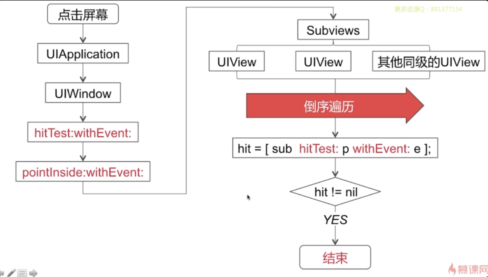
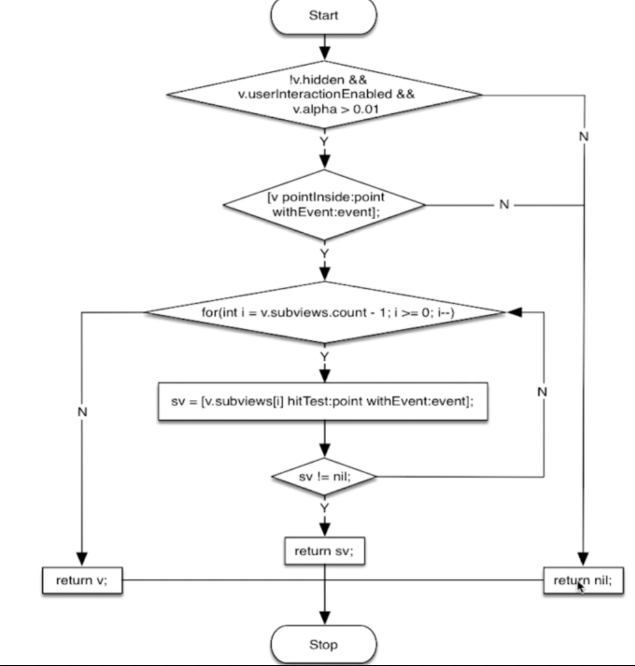
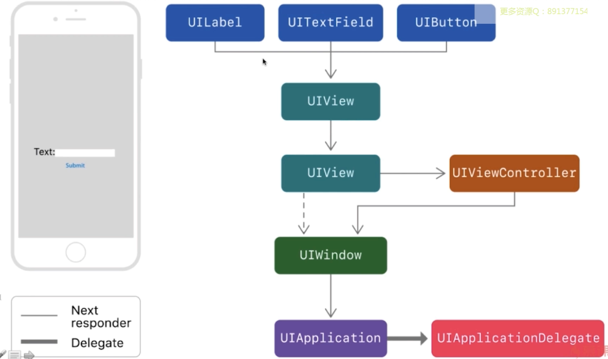

[TOC]

# 视图&图像相关

## 1. AutoLayout的原理，性能如何

参考文章：[AutoLayout 的原理性能](https://www.dazhuanlan.com/2019/10/05/5d97e8f15427d/)

## 2. UIView & CALayer的区别

* UIView 为 CALayer 提供内容，以及负责处理触摸等事件，参与响应链；

* CALayer 负责显示内容 contents
* 单一职责原则

## 3. 事件响应链



>  慕尚课程的总结图






## drawrect & layoutsubviews调用时机


### layoutSubviews

>  参考文章：[layoutSubviews和drawRect调用时机的探究](https://blog.csdn.net/wangyanchang21/article/details/50774522)

1. init初始化不会触发layoutSubviews。
2. addSubview会触发layoutSubviews。
3. 改变一个UIView的Frame会触发layoutSubviews，当然前提是frame的值设置前后发生了变化。
4. 滚动一个UIScrollView引发UIView的重新布局会触发layoutSubviews。
5. 旋转Screen会触发父UIView上的layoutSubviews事件。
6. 直接调用 setNeedsLayout 或者 layoutIfNeeded。

* `setNeedsLayout`
  标记为需要重新布局，异步调用`layoutIfNeeded`刷新布局，不立即刷新，在下一轮runloop结束前刷新，对于这一轮`runloop`之内的所有布局和UI上的更新只会刷新一次，`layoutSubviews`一定会被调用。

* `layoutIfNeeded`
  如果有需要刷新的标记，立即调用`layoutSubviews`进行布局（如果没有标记，不会调用`layoutSubviews`）。


## 4. 隐式动画 & 显示动画区别

> 解答出自 [iOS动画-CALayer隐式动画原理与特性](https://cloud.tencent.com/developer/article/1418000)。

隐式动画，指我们可以在不设定任何动画类型的情况下，仅仅改变CALayer的一个可做动画的属性，就能实现动画效果。

### 1. 事务

**事务**，其实是Core Animation用来包含一系列属性动画集合的机制，通过指定事务来改变图层的可动画属性，这些变化都不是立刻发生变化的，而是在事务被提交的时候才启动一个动画过渡到新值。任何可以做动画的图层属性都会被添加到栈顶的事务。

```objective-c
//1.动画属性的入栈
+ (void)begin;

//2.动画属性出栈
+ (void)commit;

//3.设置当前事务的动画时间
+ (void)setAnimationDuration:(CFTimeInterval)dur;

//4.获取当前事务的动画时间
+ (CFTimeInterval)animationDuration;

//5.在动画结束时提供一个完成的动作
+ (void)setCompletionBlock:(nullable void (^)(void))block;
```

现在再来考虑隐式动画，其实是Core Animation在每个RunLoop周期中会自动开始一次新的事务，即使你不显式的使用[CATranscation begin]开始一次事务，任何在一次RunLoop运行时循环中属性的改变都会被集中起来，执行默认0.25秒的动画。

通过事务来设置动画：

```objective-c
[CATransaction begin];  //入栈
//1.设置动画执行时间
[CATransaction setAnimationDuration:3];
//2.设置动画执行完毕后的操作：颜色渐变之后再旋转90度
[CATransaction setCompletionBlock:^{
  CGAffineTransform transform = self.colorLayer.affineTransform;
  transform  = CGAffineTransformRotate(transform, M_PI_2);
  self.colorLayer.affineTransform = transform;
}];

CGFloat red = arc4random() % 255 / 255.0;
CGFloat green = arc4random() % 255 / 255.0;
CGFloat blue = arc4random() % 255 / 255.0;
UIColor *randomColor = [UIColor colorWithRed:red green:green blue:blue alpha:1];
_colorLayer.backgroundColor = randomColor.CGColor;
[CATransaction commit];  //出栈
```

### 2. 图层行为

我们上述的实验对象是一个独立图层，如果直接对UIView或者CALayer关联的图层layer改变动画属性，这样是没有隐式动画效果的，这说明虽然Core Animation对所有的CALayer动画属性设置了隐式动画，但UIView把它关联的图层的这个特性给关闭了。 为了更好的理解中一点，我们需要知道隐式动画是如何实现的： 我们把改变属性时CALayer自动执行的动画称作行为，当CALayer的属性被修改时，它会调用-actionForKey:方法传递属性名称，我们可以找到这个方法的具体说明如下：

```objective-c
/* Returns the action object associated with the event named by the
 * string 'event'. The default implementation searches for an action
 * object in the following places:
 *
 * 1. if defined, call the delegate method -actionForLayer:forKey:
 * 2. look in the layer's `actions' dictionary
 * 3. look in any `actions' dictionaries in the `style' hierarchy
 * 4. call +defaultActionForKey: on the layer's class
 *
 * If any of these steps results in a non-nil action object, the
 * following steps are ignored. If the final result is an instance of
 * NSNull, it is converted to `nil'. */

- (nullable id<CAAction>)actionForKey:(NSString *)event;
```

翻译过来大概就是说：

1. 图层会首先检测它是否有委托，并且是否实现CALayerDelegate协议指定的-actionForLayer:forKey方法；如果有，就直接调用并返回结果。
2. 如果没有委托或者委托没有实现-actionForLayer:forKey方法，图层将会检查包含属性名称对应行为映射的actions字典
3. 如果actions字典没有包含对应的属性，图层接着在它的style字典里搜索属性名.
4. 最后，如果在style也找不到对应的行为，那么图层将会直接调用定义了每个属性的标准行为的+defaultActionForKey:方法

从流程上分析来看，经过一次完整的搜索动画之后，-actionForKey:要么返回空(这种情况不会有动画发生)，要么返回遵循CAAction协议的对象(CALayer拿这个结果去对先前和当前的值做动画)。现在我们再来考虑UIKit是如何禁用隐式动画的： 每个UIView对它关联的图层都遵循了CALayerDelegate协议，并且实现了-actionForLayer:forKey方法。当不在一个动画块中修改动画属性时，UIView对所有图层行为都返回了nil，但是在动画Block范围就返回了非空值，下面通过一段代码来验证：

```objective-c
@interface TestLayerAnimationVC ()

@property (nonatomic,weak)IBOutlet UIView *layerView;

@end

- (void)viewDidLoad {
    [super viewDidLoad];
   //测试图层行为：UIKit默认关闭了自身关联图层的隐式动画
    NSLog(@"OutSide:%@",[self.layerView actionForLayer:self.layerView.layer forKey:@"backgroundColor"]);
   
    [UIView beginAnimations:nil context:nil];
    NSLog(@"InSide:%@",[self.layerView actionForLayer:self.layerView.layer forKey:@"backgroundColor"]);
    [UIView commitAnimations];
}

//打印：
OutSide:<null>
InSide:<CABasicAnimation: 0x600001703100>
```

由此得出结论：当属性在动画块之外发生变化，UIView直接通过返回nil来禁用隐式动画。但是如果在动画块范围内，UIView则会根据动画具体类型返回响应的属性，

### 3. 关闭和开启隐式动画

当然，返回nil并不是禁用隐式动画的唯一方法，CATransaction也为我们提供了具体的方法，可以用来对所有属性打开或者关闭隐式动画，方法如下：

```javascript
+ (void)setDisableActions:(BOOL)flag;
```

UIView关联的图层禁用了隐式动画，那么对这种图层做动画的方法有有了以下几种方式：

1. 使用UIView的动画函数(而不是依赖CATransaction)
2. 继承UIView，并覆盖-actionforLayer:forkey:方法
3. 直接创建显式动画

其实，对于单独存在的图层，我们也可以通过实现图层的-actionforLayer:forkey:方法，或者提供一个actions字典来控制隐式动画

### 4. 自定义图层行为

通过对事务和图层行为的了解，我们可以这样思考，图层行为其实是被Core Animation隐式调用的显式动画对象。我们可以发现改变隐式动画的这种图层行为有两种方式： 1.给layer设置自定义的actions字典 2.实现委托代理，返回遵循CAAction协议的动画对象 现在，我们尝试使用第一种方法来自定义图层行为，这里用到的是一个推进过渡的动画(也是遵循了CAAction的动画类)，具体的代码如下：

```javascript
@interface TestLayerAnimationVC ()
@property (nonatomic,strong) CALayer *colorLayer;
@end

- (void)viewDidLoad {
    [super viewDidLoad];

    _colorLayer = [[CALayer alloc] init];
    _colorLayer.frame = CGRectMake(30, 30, kDeviceWidth - 60, 60);
    _colorLayer.backgroundColor = [UIColor orangeColor].CGColor;
    //自定义动画对象
    CATransition *transition = [CATransition animation];
    transition.type = kCATransitionPush;
    transition.subtype = kCATransitionFromLeft;
    _colorLayer.actions = @{@"backgroundColor":transition};
    [self.view.layer addSublayer:_colorLayer];
}

- (IBAction)changeColor:(UIButton *)sender{
    CGFloat red = arc4random() % 255 / 255.0;
    CGFloat green = arc4random() % 255 / 255.0;
    CGFloat blue = arc4random() % 255 / 255.0;
    UIColor *randomColor = [UIColor colorWithRed:red green:green blue:blue alpha:1];
    _colorLayer.backgroundColor = randomColor.CGColor;
}
```


## 5. 什么是离屏渲染

[离屏渲染专题](https://github.com/colourful987/2020-Read-Record/tree/master/topics/离屏渲染专题)

## 6. imageNamed & imageWithContentsOfFile区别

iOS加载本地图片有两种方式：imageNamed 和 imageWithContentOfFile 两种：

#### imageNamed

前者Apple官方文档有说到：

> This method looks in the system caches for an image object with the specified name and returns that object if it exists. If a matching image object is not already in the cache, this method locates and loads the image data from disk or asset catelog, and then returns the resulting object. You can not assume that this method is thread safe.

首先从系统缓存中根据图片名称寻找图片，如果找到了就返回。如果没有在缓存中找到图片，该方法会从指定的文件中加载图片数据，并将其缓存起来，然后再把结果返回，下次再使用该名称图片的时候就省去了从硬盘中加载图片的过程。对于相同名称的图片，**系统只会把它Cache到内存一次，**如果相应的图片数据不存在，返回nil。

关于加载：`imageNamed` 方法可以加载 `Assets.xcassets` 和 bundle 中的图片。

关于缓存：加载到内存当中会一直存在内存当中，（图片）不会随着对象的销毁而销毁；加载进去图片后，占用的内存归系统管理，我们是无法管理的；相同的图片是不会重复加载的，加载到内存中占据的内存较大。

```objective-c
UIImage *img = [UIImage imageNamed:@"pic"];
```

#### imageWithContentsOfFile

`imageWithContentsOfFile` 方法只是简单的加载图片，并不会将图片缓存起来，图像会被系统以数据方式加载到程序。

关于加载：`imageWithContentsOfFile` 只能加载 mainBundle 中图片。

关于缓存：加载到内存中占据的内存较小，相同的图片会被重复加载到内存当中，加载的图片会随着对象的销毁而销毁；

#### 两者应用场景

* 如果图片较小，并且使用频繁的图片使用 imageName：方法来加载
* 如果图片较大，并且使用较少，使用imageWithContentOfFile:来加载。
* 当你不需要重用该图像，或者你需要将图像以数据方式存储到数据库，又或者你要通过网络下载一个很大的图像时，使用 `imageWithContentsOfFile`；
* 如果在程序中经常需要重用的图片，比如用于UITableView的图片，那么最好是选择imageNamed方法。这种方法可以节省出每次都从磁盘加载图片的时间；

> *  [《iOS之图片加载》](https://www.jianshu.com/p/ea2a2ba3cd97)
> * [IOS如何选择图片加载方式：imageNamed和imageWithContentsOfFile的区别](https://blog.csdn.net/wzzvictory/article/details/9053813)

## 7. 多个相同的图片，会重复加载吗

答案见上

## 8. 图片是什么时候解码的，如何优化

* [iOS 图片解码（decode）笔记](https://www.jianshu.com/p/4da6981a746c)
* [探讨iOS 中图片的解压缩到渲染过程](https://www.jianshu.com/p/72dd074728d8)

## 9. 图片渲染怎么优化

> 出自 swift.gg 文章 [图像渲染优化技巧](https://swift.gg/2019/11/01/image-resizing/)

####9.1 图片尺寸**明显大于** **`UIImageView`** 显示尺寸的场景

1. [绘制到 UIGraphicsImageRenderer 上](https://swift.gg/2019/11/01/image-resizing/#technique-1-drawing-to-a-uigraphicsimagerenderer)

   ```swift
   import UIKit
   
   // 技巧 #1
   func resizedImage(at url: URL, for size: CGSize) -> UIImage? {
       guard let image = UIImage(contentsOfFile: url.path) else {
           return nil
       }
   
       let renderer = UIGraphicsImageRenderer(size: size)
       return renderer.image { (context) in
           image.draw(in: CGRect(origin: .zero, size: size))
       }
   }
   ```

   [`UIGraphicsImageRenderer`](https://developer.apple.com/documentation/uikit/uigraphicsimagerenderer) 是一项相对较新的技术，在 iOS 10 中被引入，用以取代旧版本的 `UIGraphicsBeginImageContextWithOptions` / `UIGraphicsEndImageContext` API。你通过指定以 `point` 计量的 `size` 创建了一个 `UIGraphicsImageRenderer`。`image` 方法带有一个闭包参数，返回的是一个经过闭包处理后的位图。最终，原始图像便会在缩小到指定的范围内绘制。

   > 在不改变图像原始纵横比（aspect ratio）的情况下，缩小图像原始的尺寸来显示通常很有用。[`AVMakeRect(aspectRatio:insideRect:)`](https://developer.apple.com/documentation/avfoundation/1390116-avmakerect) 是在 AVFoundation 框架中很方便的一个函数，负责帮你做如下的计算：

   ```
   import func AVFoundation.AVMakeRect
   let rect = AVMakeRect(aspectRatio: image.size, insideRect: imageView.bounds)
   ```

2. [绘制到 Core Graphics Context 上](https://swift.gg/2019/11/01/image-resizing/#technique-2-drawing-to-a-core-graphics-context)

   ```swift
   import UIKit
   import CoreGraphics
   
   // 技巧 #2
   func resizedImage(at url: URL, for size: CGSize) -> UIImage? {
       guard let imageSource = CGImageSourceCreateWithURL(url as NSURL, nil),
           let image = CGImageSourceCreateImageAtIndex(imageSource, 0, nil)
       else {
           return nil
       }
   
       let context = CGContext(data: nil,
                               width: Int(size.width),
                               height: Int(size.height),
                               bitsPerComponent: image.bitsPerComponent,
                               bytesPerRow: image.bytesPerRow,
                               space: image.colorSpace ?? CGColorSpace(name: CGColorSpace.sRGB)!,
                               bitmapInfo: image.bitmapInfo.rawValue)
       context?.interpolationQuality = .high
       context?.draw(image, in: CGRect(origin: .zero, size: size))
   
       guard let scaledImage = context?.makeImage() else { return nil }
   
       return UIImage(cgImage: scaledImage)
   }
   ```

   

3. [使用 Image I/O 创建缩略图像](https://swift.gg/2019/11/01/image-resizing/#technique-3-creating-a-thumbnail-with-image-io)

   Image I/O 是一个强大（却鲜有人知）的图像处理框架。抛开 Core Graphics 不说，它可以读写许多不同图像格式，访问图像的元数据，还有执行常规的图像处理操作。这个框架通过先进的缓存机制，提供了平台上最快的图片编码器和解码器，甚至可以增量加载图片。

   这个重要的 `CGImageSourceCreateThumbnailAtIndex` 提供了一个带有许多不同配置选项的 API，比起在 Core Graphics 中等价的处理操作要简洁得多：

4. [使用 Core Image 进行 Lanczos 重采样](https://swift.gg/2019/11/01/image-resizing/#technique-4-lanczos-resampling-with-core-image)

   Core Image 内置了 [Lanczos 重采样（resampling）](https://en.wikipedia.org/wiki/Lanczos_resampling) 功能，它是以 `CILanczosScaleTransform` 的同名滤镜命名的。虽然可以说它是在 UIKit 层级之上的 API，但无处不在的 key-value 编写方式导致它使用起来很不方便。

   即便如此，它的处理模式还是一致的。

   创建转换滤镜，对滤镜进行配置，最后渲染输出图像，这样的步骤和其他任何 Core Image 的工作流没什么不同。

   ```
   import UIKit
   import CoreImage
   
   let sharedContext = CIContext(options: [.useSoftwareRenderer : false])
   
   // 技巧 #4
   func resizedImage(at url: URL, scale: CGFloat, aspectRatio: CGFloat) -> UIImage? {
       guard let image = CIImage(contentsOf: url) else {
           return nil
       }
   
       let filter = CIFilter(name: "CILanczosScaleTransform")
       filter?.setValue(image, forKey: kCIInputImageKey)
       filter?.setValue(scale, forKey: kCIInputScaleKey)
       filter?.setValue(aspectRatio, forKey: kCIInputAspectRatioKey)
   
       guard let outputCIImage = filter?.outputImage,
           let outputCGImage = sharedContext.createCGImage(outputCIImage,
                                                           from: outputCIImage.extent)
       else {
           return nil
       }
   
       return UIImage(cgImage: outputCGImage)
   }
   ```

5. [使用 vImage 优化图片渲染](https://swift.gg/2019/11/01/image-resizing/#technique-5-image-scaling-with-vimage)

   最后一个了，它是古老的 [Accelerate 框架](https://developer.apple.com/documentation/accelerate) —— 更具体点来说，它是 `vImage` 的图像处理子框架。

   vImage 附带有 [一些不同的功能](https://developer.apple.com/documentation/accelerate/vimage/vimage_operations/image_scaling)，可以用来裁剪图像缓冲区大小。这些底层 API 保证了高性能同时低能耗，但会导致你对缓冲区的管理操作增加（更不用说要编写更多的代码了）

- **UIKit**, **Core** **Graphics**, 和 **Image** **I/O** 都能很好地用于大部分图片的优化操作。如果（在 iOS 平台，至少）要选择一个的话，`UIGraphicsImageRenderer` 是你最佳的选择。
- **Core** **Image** 在图像优化渲染操作方面性能表现优越。实际上，根据 Apple 官方 [*Core* *Image* *编程规范中的性能最佳实践单元*](https://developer.apple.com/library/mac/documentation/graphicsimaging/Conceptual/CoreImaging/ci_performance/ci_performance.html#//apple_ref/doc/uid/TP30001185-CH10-SW1)，你应该使用 Core Graphics 或 Image I/O 对图像进行裁剪和下采样，而不是用 Core Image。

## 10. 如果GPU的刷新率超过了iOS屏幕60Hz刷新率是什么现象，怎么解决