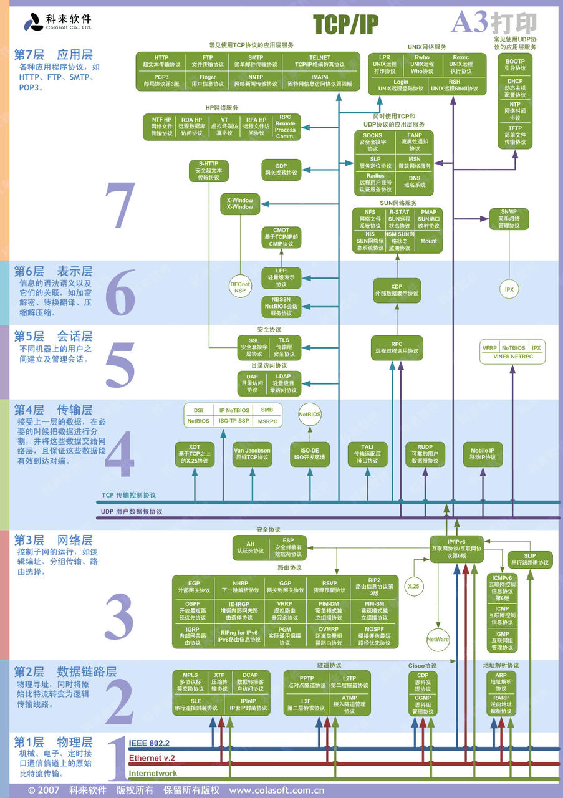

## 面试集合一

> 来源 : [iOS程序犭袁](https://github.com/ChenYilong) 大神的技术清谈微信群
>
> 进度：3/161
>
> 版本：draft
>
> 解答：pmst
>
> 最后更新：2020/06/09
>
> ⚠️:欢迎转载，转载请备注出处。

## 1. webView和wkWebView的区别

## 2. hybrid的原理，怎么调用js方法的

### 2.1 Webview URL 拦截

* oc 调用 js 代码，借助 UIWebview 和 WKWebview 类开放的两个接口：
  ```objective-c
  // UIWebview
  - (nullable NSString *)stringByEvaluatingJavaScriptFromString:(NSString *)script;

  // WKWebview
  - (void)evaluateJavaScript:(NSString *)javaScriptString completionHandler:(void (^ _Nullable)(_Nullable id, NSError * _Nullable error))completionHandler;
  ```

* js 调用 oc 方法，需要自定义一套规则，比如 `client://action?param1=xxx&param2=yyy` 等，网页端通过 `location.href` 或构造 `iframe` 发送请求，客户端拦截请求、解析、派发给指定业务模块执行:

  ```objective-c
  - (BOOL)webView:(UIWebView *)webView shouldStartLoadWithRequest:(NSURLRequest *)request navigationType:(UIWebViewNavigationType)navigationType{
      if ([request.URL.absoluteString hasPrefix:@"client://mail"]) {
         // 发送邮件
         return NO;
      }
      return YES;
  }
  ```

### 2.2 [WebViewJavascriptBridge](https://github.com/marcuswestin/WebViewJavascriptBridge) 

[WebViewJavascriptBridge 之前学习源码的一些笔记](https://github.com/colourful987/2018-Read-Record/blob/master/2018-07/2018-07-read-list.md#20180703)

### 2.3 WKScriptMessageHandler

html 向客户端发起请求，首先客户端先 `addScriptMessageHandler` 一个名为 `method` 方法，并且实现代理方法， 网页端 javascript 通过 postMessage 的方式向客户端发送消息。

```objective-c
// 客户端
- (void)setupWKWebView{
    WKWebViewConfiguration *configuration = [[WKWebViewConfiguration alloc] init];
    configuration.userContentController = [[WKUserContentController alloc] init];
    [configuration.userContentController addScriptMessageHandler:self name:@"method"];

    WKWebView *webView = [[WKWebView alloc] initWithFrame:self.view.frame configuration:configuration];
    webView.UIDelegate = self;
}

// 实现代理方法
- (void)userContentController:(WKUserContentController *)userContentController didReceiveScriptMessage:(WKScriptMessage *)message{
    if ([message.name isEqualToString:@"method"]) {
        // 解析
     }
}

// HTML
window.webkit.messageHandlers.method.postMessage() 
```

### 2.4 JavaScriptCore(UIWebview)

[深入浅出 JavaScriptCore](https://juejin.im/entry/59cde5536fb9a00a4c272e03)

### 2.5 React Native 通信

## 5. 输入网址打开一个页面的流程

* [从输入URL到页面加载的过程？如何由一道题完善自己的前端知识体系！](https://dailc.github.io/2018/03/12/whenyouenteraurl.html)
* [前端经典面试题: 从输入URL到页面加载发生了什么？](https://segmentfault.com/a/1190000006879700)
* [从输入URL到页面展示，你想知道些什么？](https://juejin.im/post/5b148a2ce51d4506965908d2)
* [从URL输入到页面展现的过程](https://zhuanlan.zhihu.com/p/33149162)

## 6. 堆的数据结构

[数据结构：堆（Heap）](https://www.jianshu.com/p/6b526aa481b1)

## 7. 二叉搜索树的作用

## 8. mmap的原理
## 
## 4. swift跟oc怎么混合开发
## 5. SSL里面怎么确保数据交换的过程、SSL 用了什么加密算法, 分别加密的是哪一个部分、为什么这么做 (提示: 对称加密、非对称加密都用到了, 对称加密传什么、非对称加密传什么东西)
## 6. WebSocket底层协议是哪一层?

Websocket 是应用层协议，全双工通讯技术，基于 TCP 传输协议，并复用 HTTP 的握手通道。

1. 浏览器、服务器建立 TCP 连接，三次握手；
2. TCP 连接成功后，浏览器通过HTTP协议向服务器传送WebSocket支持的版本号等信息，向服务端发送 websocket 的握手请求，复用了上面 HTTP 请求时 TCP 用到的握手通道；(这里客户端：申请协议升级，服务端响应协议升级，都是采用了标准的 HTTP 报文格式，且只支持GET)
3. 服务器收到客户端的握手请求后，同样采用HTTP协议回馈数据;
4. 当收到了连接成功的消息后，通过TCP通道进行传输通信；




> 图源：科来软件。


服务端代码：

```js
var app = require('express')();
var server = require('http').Server(app);
var WebSocket = require('ws');

var wss = new WebSocket.Server({ port: 8080 });

wss.on('connection', function connection(ws) {
    console.log('server: receive connection.');
    
    ws.on('message', function incoming(message) {
        console.log('server: received: %s', message);
    });

    ws.send('world');
});

app.get('/', function (req, res) {
  res.sendfile(__dirname + '/index.html');
});

app.listen(3000);
```

客户端:

```js
<script>
  var ws = new WebSocket('ws://localhost:8080');
  ws.onopen = function () {
    console.log('ws onopen');
    ws.send('from client: hello');
  };
  ws.onmessage = function (e) {
    console.log('ws onmessage');
    console.log('from server: ' + e.data);
  };
</script>
```


* [WebSocket于HTTP 、WebSocket与Socket的区别](https://juejin.im/post/5b87414951882542e56e5f39)
* [WebSocket协议：5分钟从入门到精通](https://www.cnblogs.com/chyingp/p/websocket-deep-in.html)

## 7. group 如何实现barrier类似的功能?
## 8. gcd queue 的区别
## 9. gcd、NSOperation区别, 功能方法区别.
## 10. HTTP、HTTPS 区别?
## 11. GET、POST 请求的 cache 怎么做,几级缓存? 着重讲本地缓存? 缓存有效期怎么做的?内部缓存机制的优化机制?如何防止内存、磁盘的缓存爆掉?


## 13. 什么情况下会发生 H5 白屏的情况?
## 14. 层序遍历也叫什么遍历，怎么实现
## 15. isa指针里面都存了什么，32和64位分别讲一下 
## 16. ARC下哪些情况会造成内存泄漏
## 17. AVFoundation 介绍
## 18. 给定一字符串只包含数字，请写一个算法，找出该字符串中的最长不重复子串的长度（不重复是指子串中每一元素不同于子串中其他元素）如：“120135435”最长不重复子串
## 19. TCP流量控制
## 20. 从浏览器输入url到返回页面经历了什么
## 21. 手写一下快排
## 22. 给你一个数组和一个目标值，从数组中找到三个值，使其和最接近目标值。
## 23. 给你一万亿个数据，让你取出前一百万个数据
## 24. KMP算法
## 25. 如果最高效的计算17 * 2？
## 26. 找到链表的倒数第k个结点？
## 27. 10亿个数中找最大的1000个数
## 28. 合并有序链表
## 29. PerformSelector & NSInvocation优劣对比*
## 30. HTTPS的握手过程
## 31. 简述下match-o文件结构
## 32. CTMediator
## 33. 图片是什么时候解码的，如何优化
## 34. 隐式动画 & 显示动画区别
## 35. drawrect & layoutsubviews调用时机
## 36. NSTimer、CADisplayLink、dispatch_source_t 的优劣
## 37. app如何接收到触摸事件的
## 38. 两个无限长度链表（也就是可能有环） 判断有没有交点
## 39. 二维有序数组查找数字
## 40. 把 “www.zhidao.baidu.com” 这样的字符串改成 “com/baidu/zhidao/www”。——老题目了，剑指 offer 的，两次逆序排列即可。
## 41. 两个链表中间交于某个节点，求这个结点。
## 42. 找出一个字符串中只出现一次且是第一个的字符
## 43. 最长公共前缀
## 44. 数据流中的第K大元素
## 45. 滑动窗口最大值
## 46. 前K个高频单词
## 47. 两数之和
## 48. 有效的字母异位词
## 49. 找链表的倒数第k个结点
## 50. 把一个链表比某个值大的放在左边，比它小的放在右边
## 51. 反转链表
## 52. 环形链表
## 53. 反转字符串
## 54. 读过 AFN 的源码吗？读过，那么有一个 security pin mode 是什么意思
## 55. 如何分析 linkmap
## 56. 勾住C语言的方法
## 57. 反编译
## 58. 音频降燥、视频合成
## 59. 一个项目中很多方法，把耗时的前几个方法找出来
## 60. 二叉树中增加节点
## 61. 检测主线程卡顿
## 62. 8种锁，然后问的很细，为什么这个锁性能差，那个锁性能好
## 63. HTTPS与HTTP的区别? 非对称加密、对称加密都是在哪一个步骤?
## 64. 如何实现一个网络监控? --追问--> 如果拦截 NSURLSession 具体会怎么做? 涉及哪些方法,方法名字说下?如何保证线程安全(并发场景下, 监控的线程和正常业务方的线程, 如何保证正常回调?) (考N otification的回调逻辑)
## 65. Swift、OC 如何相互调用?  Swift-->OC 、OC -->Swift? 我开发一个Swift的SDK,(API都是Swift的), 内部需要调用到 OC 的库, 要怎么做?.
## 66. 动态库和静态库区别, 优缺点辨析? --追问-->包大小的差异的原因?为什么会有差异?
## 67. 如何解决静态库符号冲突的问题?
## 68. CoreAnimation的实现原理?
## 69. 如何让 CoreAnimation 变得可交互? 比如让动画播放一半, 点击让他停止? 让他播放到50%就停止播放? --追问-->基于你的方案, 请分析CoreAnimation 内部相关接口实现原理(写出伪代码).
## 70. 我取消一个 CoreAnimation 动画? 到 50% 后, 我让他不再播放动画(不是暂停)?分析内部如何实现的?
## 71. 执行一个 NSThread 任务, 如何在执行过程中让他终止?
## 72. iOS NSOperation 是如何终止/取消任务的?
## 73. 解释一下离屏渲染, 什么场景下会出现?优化点在哪里?
## 74. 介绍下 Swizzle 的步骤? 具体到方法名.
## 75. Swizzle 时, 我不想替换父类, 只想替换子类,怎么办?
## 76. Swizzle 的优缺点? 缺点会导致什么问题?
## 77. 响应链: 如果 Swizzle 了 父 View 的  touchBegin  的方法, 会对子 View 造成什么影响?
## 78. GCD group 如何实现同步的? (还能用什么实现?)
## 79. 线程、队列的关系? 一个线程是否可能存在于两个队列?
## 80. 队列一定会创建线程吗?
## 81. 队列是否可以无限制创建?
## 82. 内存泄漏如何检测? 要求能具体到循环引用链条, 你用到的工具(比如:https://github.com/facebook/FBRetainCycleDetector)实现原理怎么做?
## 83. 讲一下组件化/SDK中的接口设计规范有哪些?(比如: API break change 升级常见、预留字段、)
## 84. 公司有多个项目启动, 如何让接入的组件效率提升? (不局限于iOS, 要讲前后端配合的方案, 偏重量级的方案)
## 85. WKWebView 如何解决 cookie 、跨域、方法拦截、等问题?
## 86. 自己做SDK 如何解决与接入方的SDK 版本冲突?(考虑包大小、研发人力、维护成本)
## 87. 组件化/SDK 怎么分层的、怎么封装的?如何协调不通部门的人去共享你的组件/SDK?(参数上下文、接口设计高度抽象)
## 88. 你们 hybrid APP 技术方案跨端方案(weex、RN、flutter)选择? 与 h5 hybrid 方案相比优缺点, 哪些场景需要用到native、哪些页面h5、哪些页面用跨端方案(weex、RN、flutter) ?
## 89. 如果你做的是一个超级 APP (微信、淘宝), 里面有一个引擎可以运行不同的小程序, 你如何设计保证小程序之间的安全性?
## 90. 介绍一下你们APP的架构设计
## 91. H5 与 跨端方案(weex、RN、flutter) 如何进行代码复用、适配?
## 92. OC 是否支持重载? 为什么?
## 93. 堆和栈的区别是什么?
## 94. 栈、堆分别是否会被线程所共享?
## 95. 内存空间中除了堆和栈还有什么内容?
## 96. HTTP 请求方法种类有哪些?(别忘记HEAD)
## 97. RN、weex 前端页面 怎么渲染到native页面上的? (答案提示 node节点树)
## 98.  DNS、工作在什么层、默认端口?
## 99. SSL里面怎么确保数据交换的过程、SSL 用了什么加密算法, 分别加密的是哪一个部分、为什么这么做 (提示: 对称加密、非对称加密都用到了, 对称加密传什么、非对称加密传什么东西)
## 100. 方法如果写了多个分类、会执行哪一个?执行逻辑是什么样?
## 101. IMP、SEL Method 都表示什么意思?   与 _cmd 相关
## 102. weak 如何把 对象重制为 nil
## 103. assign、strong 区别, 是否能用assign修饰 NSObject?
## 104. 删除单链表的倒数第 K 个节点
## 105. 方法交换和分类同时去hook同一个方法, 结果会怎么样? 具体交换的是什么? 交换时是如何处理传参数? 如果使用 NSInvocation 的话, 是否能处理方法有返回值的场景?具体怎么处理的?
## 106. 介绍Weex/RN的渲染原理? 与 Flutter 渲染的区别? 目录树的步骤是在哪里的? iOS/android渲染出来的树是否一致?
## 107. Weex JS 运行环境是多个还是一个?
## 108. Weex/RN 与 H5、native 相比的优缺点?
## 109. Weex/RN 与 H5 白屏的原因?
## 110. 你认为c++、与大前端相关的语言,比如objc、swfit、js相比它的优缺点?
## 111. mutablearray是怎么实现的，mutablearray申请内存空间干什么用，做增删操作的时候内存空间是怎么改变的，可以用别的方法实现吗？
## 112. [mutablearry alloc]init 和 [nsmublearray array]有什么区别
## 113. https为什么能被抓包？抓到https的原理是什么
## 114. 结构体中为什么不能使用oc对象
## 115. 我们在开发中使用文件的.mm是基于什么原因?
## 116. 我们使用__bridge来进行修饰是为了做什么？
## 117. person有个+test方法，实现输出persion test，student继承persion，头文件定义-test方法，但没实现，student *obj=new student   [obj test]结果是啥
## 118. string和NSString的区别
## 119. dynamic 在swift与OC中的作用
## 120. protobuf的原理
## 121. rn 与 flutter 的区别，flutter 组件渲染规则
## 122. gcd 的使用，能不能取消？
## 123. APP 架构师对什么指标比较关心?
## 124. 32位系统和64位系统的本质区别是什么？
## 125. 动态库和静态库区别, 优缺点辨析? --追问-->包大小的差异的原因?为什么会有差异?
## 126. Swift、OC 如何相互调用?  Swift-->OC 、OC -->Swift? 我开发一个Swift的SDK,(API都是Swift的), 内部需要调用到 OC 的库, 要怎么做?.
## 127. 什么情况下会发生 H5 白屏的情况? 
## 128. OOM (Out Of Memory) 类型的 crash介绍下, 怎么检测, 怎么处理?
## 129. websocket 协议 与 MQTT 协议的区别? MQTT 是否支持搭配 websocket 实现聊天功能?
## 130. 弱网情况下 IM 即时通讯的优化? 比如: 网络抖动.
## 131. 什么是 SNI? SNI 是什么的缩写? iOS上想设置 SNI , 怎么设?
## 132. 排序算法, 字母和数字排序, 字母优先级高于数字: abc123.

## 算法 / Coding

### 9. 堆排序、归并排序、快排原理，优缺点

堆排序：

```c

```

归并排序:

```c

```

快排：

```c

```


###12. 请手写一份 LRU 实现 (要求先介绍 LRU 实现, LRU如何 key-value 的数据进行处理)

```go
type LRUCache struct {
	size,capacity int
  cache map[int] *LinkedNode
  head,tail *LinkedNode
}
type LinkedNode struct {
  key, value int
  prev, next *LinkedNode
}

func initLinkedNode(key, value int)*LinkedNode {
  return &LinkedNode {
    key:key,
    value:value,
  }
}

func Construct(capacity int)LRUCache {
  l := LRUCache {
    size: 0,
    capacity:capacity,
    cache:map[int]*LinkedNode {},
    head:initLinkedNode(0,0),
    tail:initLinkedNode(0,0)
  }
  l.head.next = l.tail
  l.tail.prev = l.head
  return l
}

func (this *LRUCache)removeNode(node *LinkedNode){
  node.prev.next = node.next
  node.next.prev = node.prev
}

func (this *LRUCache)addTohead(node *LinkedNode){
  node.prev = this.head
  node.next = this.head.next
  this.head.next.prev = node
  this.head.next = node
}

func (this *LRUCache)moveTohead(node *LinkedNode){
  this.removeNode(node)
  this.addTohead(node)
}

func (this *LRUCache) Get(ket int)int {
  if _,ok := this.cache[key]; !ok {
    return -1;
  }
  node := this.cache[key]
  this.moveTohead(node)
  return node.value
}

func (this *LRUCache) removeTail() *LinkedNode{
    node := this.tail.prev
    this.removeNode(node)
    return node
}

func (this *LRUCache) put(key, value int){
  if _,ok := this.cache[key]; !ok{
    node := initLinkedNode(key,value);
    this.cache[key] = node
    this.addTohead(node)
    this.size++
    if this.size > this.capacity {
      removed := this.removeTail()
      delete(this.cache, remove.key)
      this.size--
    }
  } else {
    node := this.cache[key]
    node.value = value
    this.moveTohead(node)
  }
}
```


## 面试集合二

### 1.  结构体的字节对齐和OC对象的字节对齐？
### 2. instance（实例对象）、class（类对象）、meta-class（元类对象）分别储存了什么信息？为什么要设计元类？
### 3. KVO的具体实现流程？访问成员变量（类似self->age）会触发KVO嘛？KVC会触发KVO嘛？KVO的两个核心调用方法是？
### 4. KVC的原理？getter 和 setter 的搜索策略是什么？KVC 有什么实际的应用？
### 5. Catagory 和 extension 分别的使用场合和特点是什么？
### 6. Catagory 的实现原理是什么？Catagory 有哪些用处？Catagory 有什么局限？
### 7.  Class 和 他的 Catagory 同名方法的调用顺序是什么？Catagory A 和 Catagory B 同名方法的调用顺序是如何？如果想要不按照系统顺序执行要怎么做？
### 8. +load 和 +initialize 的调用时机和顺序？两者区别是什么？
### 9. Catagory 有 +load 方法么？+load 是什么时候调用的？能继承么？会覆盖Class 的 +load 么？
### 10. Catagory关联对象（AssociateObject）的底层实现是什么？
### 11. block 的本质是什么？block 的底层实现是怎样的？block 的变量捕获是什么原理？block 的类型有哪些？什么情况下会把栈上的 block 赋值到堆上？
### （block 我真的好多都没记住啊...）
### 12. isa 指针是什么？里面有哪些特殊的位数？什么是TaggedPointer的优化？
### 13. class 的底层结构是什么样的？
### 14. method_t 里包含什么？
### 15. super 的本质是什么？
### 16. OC的消息机制有几步？
### 17. 如何防止类似 unrecognized selector 的错误？_objc_msgForward能干什么？
### 18. runtime 有哪些应用？方法替换（method - Swizzling）有什么缺点？如何安全的进行方法替换？
### 19. RunLoop 的本质是什么？
### 20. Runloop和线程是什么关系？
### 21. Runloop的底层数据结构是什么样的？有几种 运行模式（mode）？每个运行模式下面的 CFRunloopMode 是哪些？他们分别是什么职责？
### 22. Runloop 的监听状态有哪几种？
### 23. Runloop 的工作流程大概是什么样的？
### 24. Runloop 有哪些应用？
### 25. 多线程，异步执行（async）一个performSelector 会执行么？如果加上 afterDelay呢？
### 26. 你知道 iOS 有哪些锁？性能分别怎么样？
### 27. 自旋锁和互斥锁怎么选择？
### 28. 引用计数怎么实现的？weak怎么实现的？sideTable的 底层结构是怎么样的？ weak指针做了什么操作？
### 29. AutoReleasePool（自动释放池） 的底层实现是什么？他怎么实现及时释放的？子线程的释放时机是怎么样的？
### 30. 对象的 release 是怎么处理的？