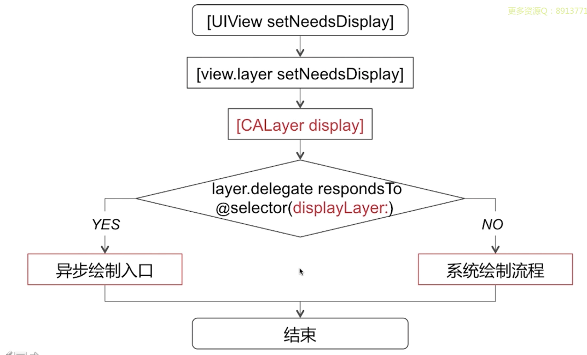
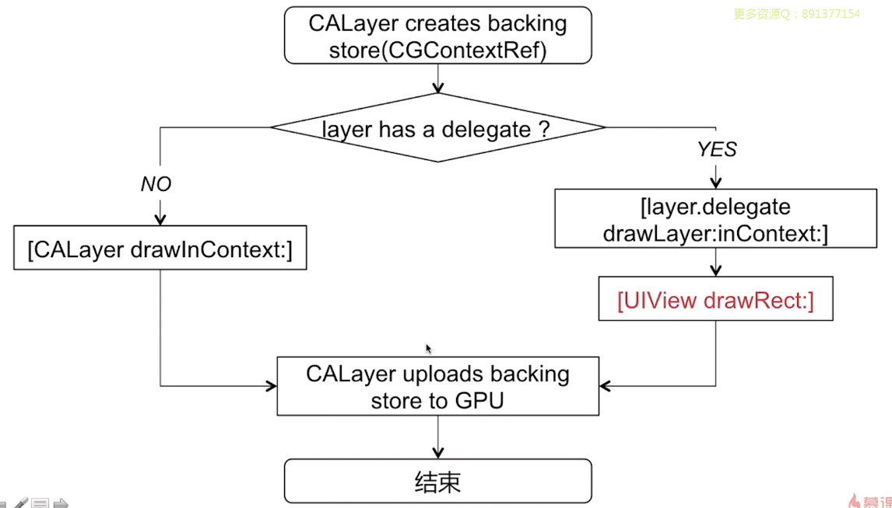

# iOS 渲染过程

> 待完善

## UIView & CALayer的区别

* UIView 为 CALayer 提供内容，以及负责处理触摸等事件，参与响应链；
* CALayer 负责显示内容 contents
* 单一职责原则

## iOS 渲染过程

首先调用 `setNeedsDisplay` 给视图打上脏标记，等待 runloop 进入休眠前进行处理

> 慕尚课程的总结图